<p align="center">
  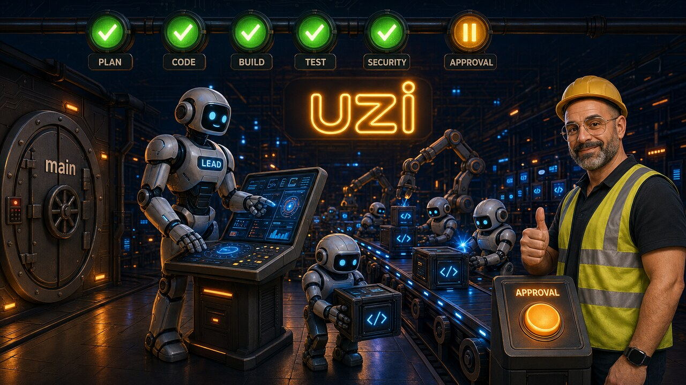
</p>

<h1 align="center">uzi</h1>

<p align="center"><b>An AI dark factory: issues in, reviewed pull requests out.</b></p>

<p align="center">
  <a href="LICENSE"></a>
  <a href="https://github.com/vtmocanu/uzi/releases"></a>
  
  
  <a href="https://github.com/vtmocanu/uzi/stargazers"></a>
</p>

A **dark factory** runs with the lights off: no human on the floor. Machines take the raw input, do the work, and hand back a finished part. I built one for software. It is called **uzi** (Uzinele Întunecate, "dark factories"), and it is open source.

You point it at a forge (GitLab, GitHub, or Forgejo), label an issue `uzi`, and it plans the work, waits for your approval, writes the code under an implement-and-review loop, opens a pull request from a fresh branch, and moves the issue to human review. When a CI pipeline goes red, it diagnoses the failure and opens a fix. The lights are off the whole time. You show up for two decisions: **approve the plan**, and **merge the PR**.

Not a *fully* dark factory, and on purpose: those two decisions stay human, and (unless you opt into autopilot) nothing is written until you sign off on the plan. The lights are off for the work, not for the call to ship.

<p align="center">
  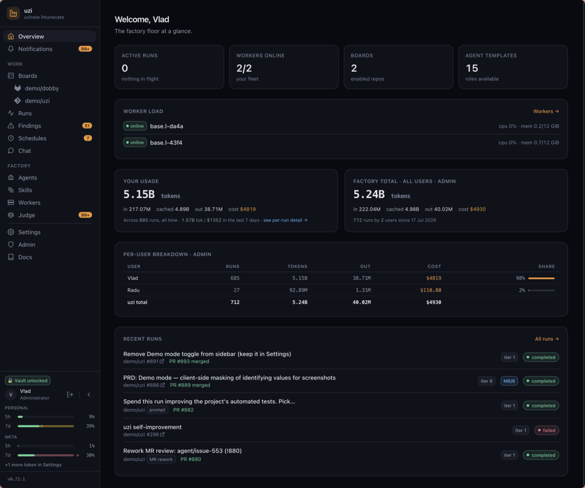
</p>

## How it works

The unit of work is an **issue**, not a chat message. The forge stays the source of truth the whole way through, so the work shows up where your team already looks: as issues, branches, and pull requests. If the issue links a spec document, uzi picks it up automatically, but a full spec is not required to start.

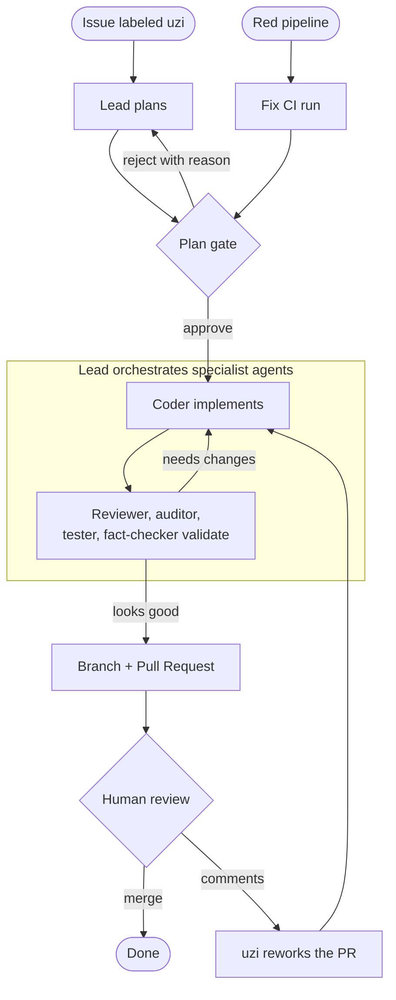

1. **Plan first.** A worker claims the issue and produces a plan, then parks at an approval gate with that plan in view. You approve it, or reject it with a reason and it re-plans. Nothing is written until you say go. (Prefer unattended? An [autopilot](docs/autopilot.md) mode skips the gate and takes an issue straight to a PR.)
2. **Implement and review.** On approval, a **lead** agent orchestrates the work: a **coder** implements, then a **reviewer**, **auditor**, **tester**, and **fact-checker** validate in parallel, looping back to the coder until the work holds up. You can watch every agent's transcript stream live and steer mid-run.
3. **Branch and PR, never `main`.** On completion, uzi opens a branch and a pull request and moves the issue to human review. `main` is never touched, by design, even under an adversarial prompt: see [ARCHITECTURE.md](ARCHITECTURE.md#guardrail-layers-the-primary-directive) for why that holds.

<p align="center">
  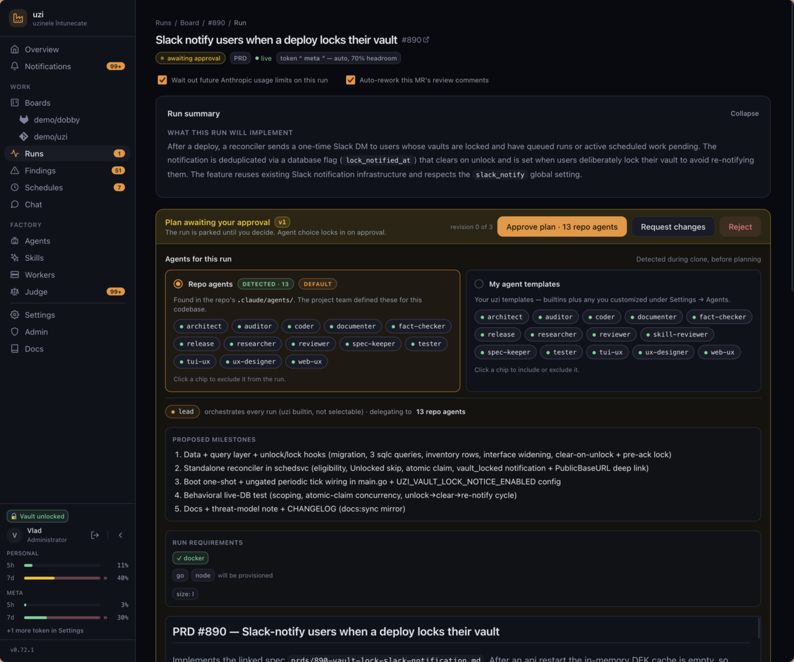
</p>

## Quick start

### On your laptop (Docker Compose)

```sh
./scripts/init-env.sh   # generates JWT_SECRET, UZI_SECRET_KEY, POSTGRES_PASSWORD into .env, once
docker compose up
```

`init-env.sh` writes `.env` only if it is absent and never regenerates it, so your encryption key and Postgres password stay stable across restarts. (Prefer setting them by hand? `cp .env.example .env` and fill in the three values, e.g. `openssl rand -hex 64` / `-base64 32` / `-hex 24`.)

Open <http://127.0.0.1:8080> and register. The first account to register becomes the admin, or seed one automatically with `UZI_SEED_EMAIL` / `UZI_SEED_PASSWORD` (see [docs/configuration.md](docs/configuration.md)).

### On Kubernetes (Helm)

The chart ships to GitHub Container Registry as a public, signed OCI artifact. It is an umbrella: one release brings up the API, the web app, and a CloudNativePG Postgres cluster in a single namespace.

```sh
helm install uzi oci://ghcr.io/vtmocanu/uzi/uzi \
  --version <version> \
  --namespace uzi --create-namespace \
  --values my-values.yaml
```

Your `my-values.yaml` sets the secrets, your public host, and turns the bundled Postgres on. See [deploy/README.md](deploy/README.md) for the values reference.

### Connect a forge

The board works against issues on your forge, through a per-user bot account so uzi's actions are attributable and scoped:

1. Create a bot account on your forge, give it an API-scoped token, and add it to the project you want uzi to work on. Setup per forge: [GitLab](docs/gitlab-bot-setup.md), [GitHub](docs/github-bot-setup.md), [Forgejo](docs/forgejo-bot-setup.md).
2. In uzi, go to **Settings → Forge**, pick the base URL, and paste the token.
3. Under **Boards**, enable that project.
4. Open its board from the sidebar. Your issues show up as cards; label one `uzi` to hand it to the factory (see [docs/board.md](docs/board.md)).

<p align="center">
  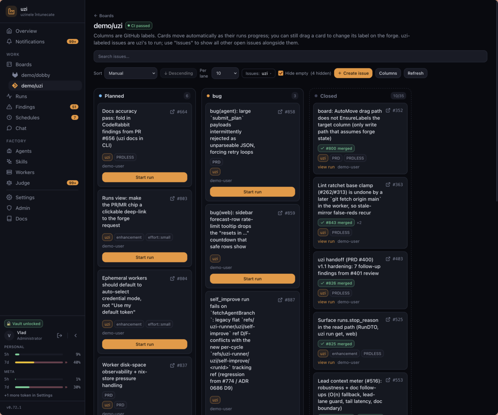
</p>

### Add your model token and a worker

1. Under **Settings**, save your Anthropic token. Runs spend it on your own account, so cost and rate limits stay yours (see [docs/anthropic-token.md](docs/anthropic-token.md)).
2. Add a **worker**, the container that claims runs and does the agent work. Locally, generate a join token under **Settings → Workers** and start the bundled worker with `docker compose --profile agent up`. On Kubernetes, turn on worker hosting in your Helm values and provision one straight from **Settings → Workers** (see [docs/worker-setup.md](docs/worker-setup.md)).

That is the whole setup. Pick an issue, label it `uzi`, hit **Start run**, approve the plan when it pauses, and watch it work.

## Watch it work

Nothing about a run is a black box. A per-agent activity feed shows what each role is doing right now, so you can see the lead orchestrating while the coder implements one milestone and the reviewer and auditor check the last. Expand any entry and it streams that agent's own transcript, its reasoning and each tool call, as it happens. You can also send a follow-up mid-run to steer it.

<p align="center">
  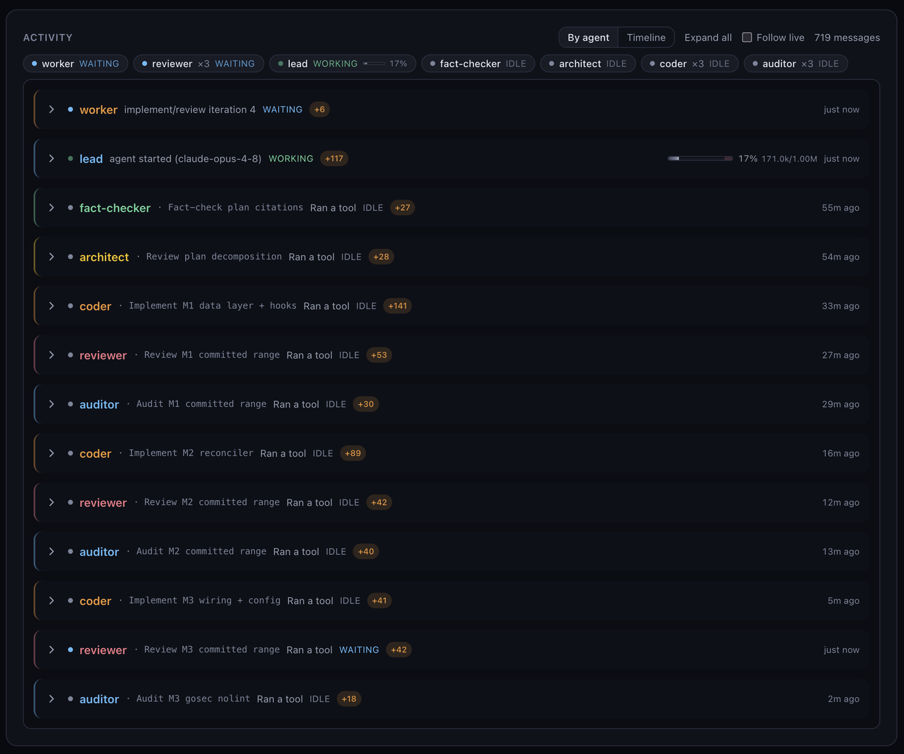
</p>

The lead works the approved plan one **milestone** at a time, committing each as its own reviewed slice and ticking it off as it lands, so even a long run shows honest progress instead of a spinner.

<p align="center">
  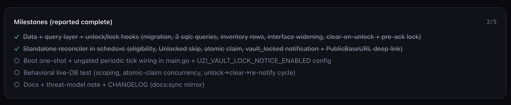
</p>

## Fix a red pipeline

uzi watches the CI pipeline on every branch it cares about and shows a status badge on the repos list, the board header, and each run's card. When a pipeline goes red, a **Fix CI** button appears. A plan-gated fix run reads the failed jobs' logs, reproduces the failure, proposes a root-cause fix (or reports that the failure is not a code problem), and opens a PR once you approve. It then verifies itself: when the fix branch's pipeline concludes, the run's verdict flips to **verified** or **fix failed**. It still never merges for you. See [docs/ci-autofix.md](docs/ci-autofix.md).

## Rework a PR from review

The loop does not stop at "PR opened". When a pull request from a completed run picks up new review comments on a green pipeline, uzi can rework the branch to address them on its own, on the same PR, without closing the card and starting over. It reads the review threads (human reviewers and third-party review bots alike), implements the findings that still hold, and replies in each thread with what it did before resolving it. Review comments are the least trustworthy input a factory ingests, so uzi treats them as data, never commands: reply and resolve are scoped server-side to the threads a run actually addressed. See [docs/mr-review-watcher.md](docs/mr-review-watcher.md).

## The judge

An optional **run judge** gives every finished run a retrospective: it reads the whole run trace and produces a verdict plus concrete recommendations. It is advice, not a gate, and it never changes code. A judge menu collects those recommendations across runs, deduped and ranked by how often each recurs, so you can triage a whole class at once. Off by default, and it runs on your own Anthropic token. See [docs/judge.md](docs/judge.md).

<p align="center">
  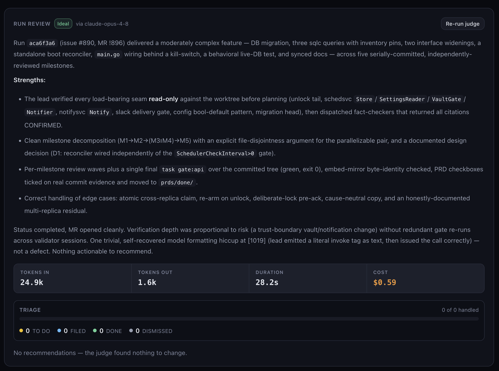
</p>

## Schedules: the factory on a cadence

uzi ships a catalogue of standing automations you can enable per repo, so the factory keeps working on a cadence instead of only on demand. Pointed at its own repo, they add up to a self-improvement loop: uzi hunts its own bugs, strengthens its tests, keeps its docs honest, and even proposes its next feature.

| Schedule | What it does | Cadence |
|---|---|---|
| `bug-triage` | sweeps `bug`-labeled issues | daily |
| `planned-sweep` | sweeps `Planned`-labeled issues | daily |
| `docs-hygiene` | mechanical documentation fixes | weekly |
| `test-improvement` | lands new tests only, no production code | weekly |
| `bug-hunt` | a deep audit of one subsystem, one focused fix | weekly |
| `self-improve` | scans the codebase and opens a self-improvement PR | every couple of days |
| `feature-bingo` | brainstorms one new feature and proposes it | weekly |

`feature-bingo` is the factory designing its own next machine: once a week it reads the existing ideas, checks what already exists so it does not repeat itself, and opens a PR proposing exactly one concrete new feature. Every scheduled job falls back to a plain report when it has nothing worth landing, so a quiet week produces no empty pull requests. See [docs/scheduling.md](docs/scheduling.md).

<p align="center">
  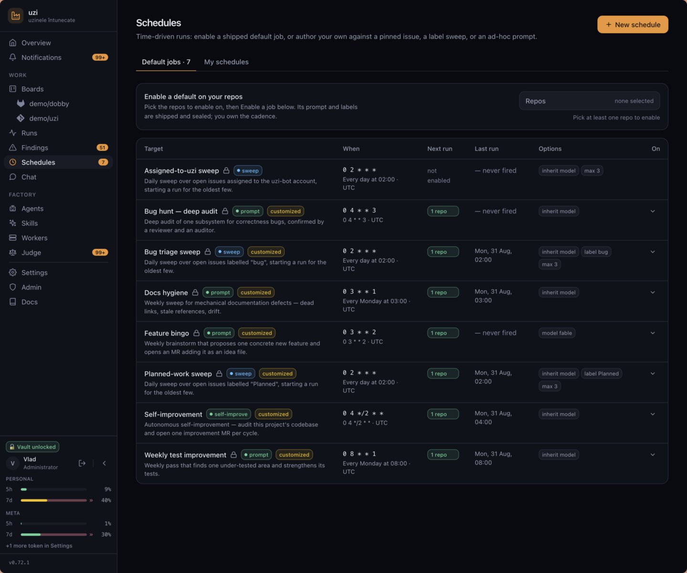
</p>

## Every run is costed

Runs use your own Anthropic token, so every run is fully costed. Its stats panel gives the total tokens in and out, how much came from cache, the wall-clock duration, and the dollar cost, then breaks that down per phase and per agent, so you can see exactly where a run spent its budget. A hosted run is usually cheaper than doing the same work in a local agent session on the same model tier: [why a hosted run costs less](docs/run-cost.md).

<p align="center">
  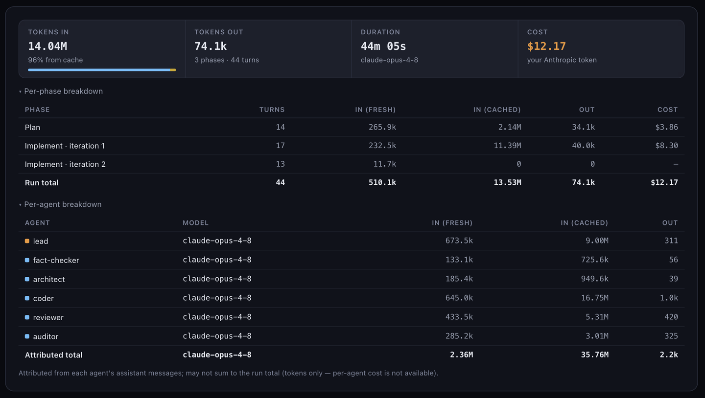
</p>

## Drive it from the terminal

The CLI is the way I recommend driving uzi, ideally via your own agent through the skill it bundles. Everything the web board does, the `uzi` CLI does without a browser tab: readable tables for humans, `--json` output with documented exit codes for agents.

```sh
brew tap vtmocanu/tap
brew trust --tap vtmocanu/tap       # one-time: Homebrew 6+ requires trusting third-party taps
brew install vtmocanu/tap/uzi-cli
uzi login                            # humans; or set UZI_TOKEN from Settings → Access
uzi skill install-hook               # Claude Code users: refresh the bundled skill each session
uzi run list                         # the board, as a table
uzi run get <id>                     # one run's state
uzi run logs <id> -f                 # follow the transcript live
```

An agent drives it fully headless with a Bearer token in `UZI_TOKEN`: no browser, no cookie. The CLI also carries uzi's full docs offline (`uzi docs search`, `uzi docs show`), and `uzi tui` opens a full-screen terminal dashboard of runs that need you, runs in flight, and rate-limit meters. See [docs/cli.md](docs/cli.md).

<p align="center">
  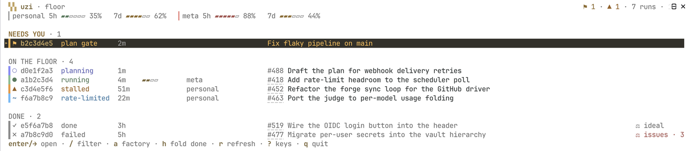
</p>

## And more

- **[Chat](docs/chat.md) and [Slack](docs/slack.md)**: a conversational surface in the web app or a Slack DM, and run notifications you can approve, reject, or steer from Slack.
- **[Handoff](docs/handoff.md)**: a lighter lane that pushes your local working tree to a branch and starts a run with no issue and no plan gate.
- **[Findings](docs/findings.md)**: incidental bugs a run spots outside its task, deduped and filed on your say-so.
- **The worker fleet**: load balancing across workers, [ephemeral workers](docs/hosted-workers.md) for one-off capabilities, and on-demand [devbox](https://www.jetify.com/devbox) tools ([worker docs](docs/worker-tools.md)).
- **Your tokens**: pool more than one and auto-select the one with the most [rate-limit](docs/rate-limits.md) headroom; a run that hits a cap pauses and resumes on its own.
- **[Memory](docs/memory.md)**, **[agent templates and skills](docs/agent-templates.md)**, **[OIDC SSO](docs/oidc.md)**, **[GitHub Projects sync](docs/github-project-sync.md)**, and **[cosign-signed images](docs/container-signing.md)**.
- The whole web UI is responsive, so you can browse the factory and approve a plan from your phone.

## Multi-forge

GitLab, GitHub, and Forgejo sit behind one driver. GitLab and GitHub are the paths I run day to day; Forgejo is supported too, but less battle-tested so far.

## Status: alpha (and uzi builds uzi)

Treat it as **alpha**. Features land often, refactors happen often, and breaking changes are on the table. But it is not a toy: it is stable and it works well day to day, having already completed roughly 700 runs and spent over 5 billion tokens getting here.

And the fun part: **uzi builds uzi**. A growing share of it is written by itself. I file the issues, it plans, implements, and opens the PRs, so the factory is quietly assembling its own next version while I review.

uzi is not a finished product. It has just enough built to show where it is heading and to let you shape that, so try it, open issues, request features, send PRs, and tell me what works and what does not.

## Documentation

Full docs live in [docs/](docs/), and the same golden-path pages are browsable in-app under **Docs**.

**Getting started:** [Getting started](docs/getting-started.md) · [Installation (dev)](docs/installation.md) · [Configuration](docs/configuration.md) · [Anthropic token](docs/anthropic-token.md) · [Worker setup](docs/worker-setup.md) · bot setup for [GitLab](docs/gitlab-bot-setup.md) / [GitHub](docs/github-bot-setup.md) / [Forgejo](docs/forgejo-bot-setup.md)

**Using uzi:** [Board](docs/board.md) · [CLI](docs/cli.md) · [Autopilot](docs/autopilot.md) · [Chat](docs/chat.md) · [Slack](docs/slack.md) · [Handoff](docs/handoff.md) · [Judge](docs/judge.md) · [Findings](docs/findings.md) · [Scheduling](docs/scheduling.md) · [Memory](docs/memory.md) · [Agent templates](docs/agent-templates.md)

**Operating:** [Hosted workers](docs/hosted-workers.md) · [Worker model](docs/worker-model.md) / [tools](docs/worker-tools.md) / [Docker](docs/worker-docker.md) · [Rate limits](docs/rate-limits.md) · [OIDC](docs/oidc.md) · [Updates](docs/updates.md) · [Admin settings](docs/admin-settings.md)

**Design:** [Auth design](docs/auth-design.md) · [Proc hardening](docs/proc-hardening.md) · [Security gate](docs/security-gate.md) · [Vault threat model](docs/vault-threat-model.md) · [Why a hosted run costs less](docs/run-cost.md) · [Developer conventions](docs/dev-conventions.md)

See [ARCHITECTURE.md](ARCHITECTURE.md) for the system shape, [prds/](prds/) for product specs, and [specs/](specs/) for the requirements contract ([human.md](specs/human.md)) and design decisions ([ai.md](specs/ai.md)).

## Contributing

See [CONTRIBUTING.md](CONTRIBUTING.md) for contribution guidelines and [prds/](prds/) for active work. The upside of catching uzi this early is that you get to shape where it goes, so issues and PRs are genuinely welcome.

## License

[MIT](LICENSE) © 2026 Vlad Mocanu / METAMINDS
