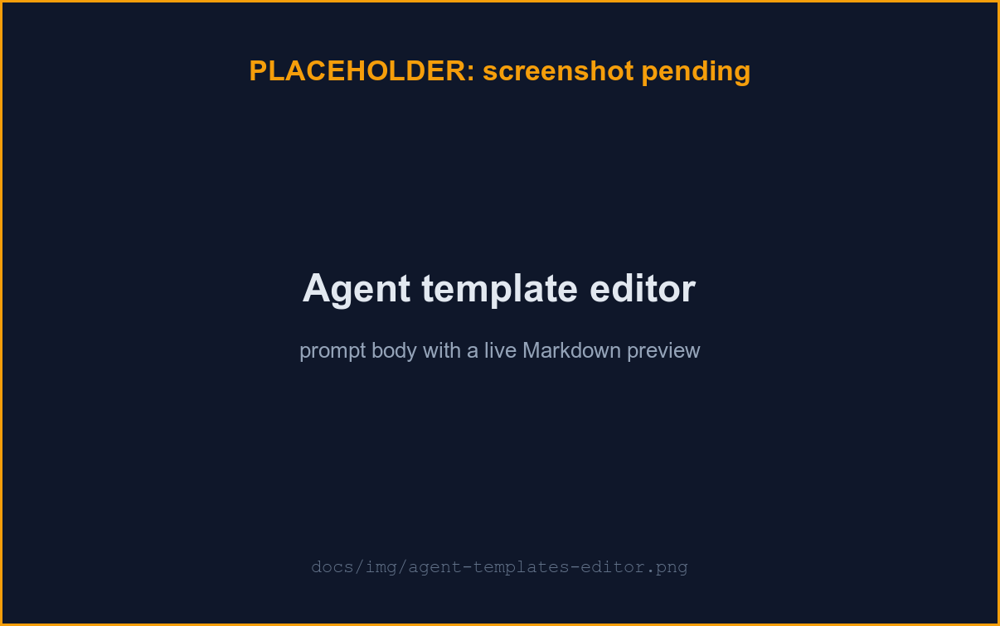

# Agent templates

An agent template defines one role an agent can play: a name, a
one-sentence description, an optional model override, an optional tools
allowlist, and a system prompt body. Manage them from **Agents**.

## Scopes

Every template has a scope that decides who sees it and who can edit it:

| Scope | Who sees it | Who edits it |
|---|---|---|
| **Builtin** | Everyone | Admins (edit or reset; never deletable) |
| **Global** | Everyone | Admins |
| **Mine** (user) | Only you | Only you |

Anyone can create their own **Mine** template (persona and workflow only —
the worker's guardrails apply no matter what the prompt says). An admin can
additionally publish a **Global** one for everyone. `lead` and
`orchestrator` are reserved: a template you create may not take those names.

## Builtin roles

uzi seeds twelve builtin templates:

| Name | What it does |
|---|---|
| `lead` | Plans the task, delegates, and drives the run through the approval gate. |
| `coder` | Implements features, fixes bugs, refactors code. |
| `reviewer` | Reviews code changes for correctness, style, and edge cases. |
| `auditor` | Audits code for security vulnerabilities and unsafe patterns. |
| `tester` | Validates changes against representative real-world inputs, authoring and extending tests as part of the implementation phase. |
| `architect` | Designs the approach before coding and reviews changes for architectural fit; writes design docs only, and only once the plan is approved. |
| `documenter` | Updates documentation only; never touches source code. |
| `fact-checker` | Adversarially verifies factual claims against authoritative sources. |
| `spec-keeper` | Keeps `specs/` in sync with implementation work. |
| `researcher` | Investigates the codebase or external sources to gather context; reports findings only. |
| `web-ux` | Validates web interfaces in a real browser (agent-browser), reviewing UX, accessibility, and visual consistency; reports findings only. |
| `ux-designer` | Sets opinionated visual and information-architecture direction, then builds and browser-validates the frontend/UI; owns the design layer and defers backend logic to the coder. |

The `lead` is the orchestrator: the main agent thread. It runs on `opus`
by default unless you set a personal override in
[Worker model](./worker-model.md). Editing a template's prompt only tunes
its persona and workflow; the primary-directive guardrails (never touch
`main`, no `git push`, the plan gate) are enforced by the worker regardless.

The builtin `fact-checker`'s `tools:` allowlist names six
`mcp__forge__*` entries, so it alone can read the run's own forge (issues,
merge requests, pipelines, label history) to check a claim against live
state — see [Forge read tools](./forge-read-tools.md). A template with no
`tools:` list inherits everything, forge tools included; a template with
its own explicit allowlist gets forge access only if you add an
`mcp__forge__*` entry to it yourself.

## Parallel dispatch

The lead can dispatch more than one subagent in the same turn when their
work doesn't overlap, instead of always waiting for one to finish before
starting the next:

- **Validators fan out together, once per unit.** The lead sends every allocated
  validator (`reviewer`, `auditor`, `tester`, `fact-checker` — whichever the run
  allocated) in one wave rather than one at a time: first over the **plan**,
  before it reaches you at the approval gate, and then again each time an
  implementation unit lands — over that unit's **immutable commit range**, not the
  live working tree, so a later unit's edits can't be mis-attributed to it. There
  is one review procedure, run per unit and early, rather than a single wave held
  to the end of the run. The plan-time wave is what backs up the plan's claims —
  for every mechanism the plan asserts, it names the file and quotes the line — so
  what you approve has already been read against the code. Of those four,
  `reviewer`, `auditor` and `fact-checker` declare no file-writing tools at all,
  so they are read-only everywhere; `tester` does declare them, because authoring
  tests is its job during implementation.
- **Nothing a subagent does before the gate can change the worktree by the
  ordinary route.** On the planning turn the worker takes the file-writing tools
  (`Edit`, `Write`, `MultiEdit`, `NotebookEdit`) off every subagent it dispatches,
  so what you approve is not quietly accompanied by edits you never saw. This is
  half of the property, and the honest half to state: those roles still have
  `Bash`, and the worker does not screen shell redirection, so the lead's
  report-only instruction to the wave still carries the rest. Like everything
  else in a prompt, that part is an instruction rather than one of the guardrails
  the worker enforces.
- **Coders fan out only for genuinely independent units.** The lead
  parallelizes implementation work only when the plan splits it into pieces
  that share no Go package, no TypeScript project, and no file (including
  `go.mod`, lockfiles, generated code, or wiring/registration files) between
  them. Each parallel coder gets an explicit file scope in its delegation
  prompt, doesn't commit, and doesn't run repo-wide build or test commands;
  the lead diffs the working tree against the last commit to confirm only the
  declared scopes changed, commits each landed unit, then runs the quality gate
  over that commit — overlapped with the read-only validator wave rather than
  serialized ahead of it, but still blocking: a red gate holds that unit, it is
  not advanced or built on until the gate is green.
- **A unit others depend on can publish its seam early.** When the plan declares
  that one unit's output (a schema change, a shared type, an interface or route
  shape) another builds on, the lead can land and commit that seam first so the
  dependents start against it — but only once the seam has actually been exercised
  by a test, not merely compiled.
- **Anything uncertain stays serial** — overlapping scope, a dependency
  between units, or a fix that depends on a reviewer's finding.

You'll see this on a run's activity feed as multiple subagents active within
the same turn. Two parallel invocations of the same coder template currently
render as one merged section with interleaved messages — per-invocation
attribution is a possible future improvement, not built yet.

There's no separate concurrency cap for subagents within a run; width is
bounded by how the plan splits, and by the lead defaulting to serial whenever
it's unsure. It also compounds with
[worker run concurrency](./worker-setup.md#concurrent-runs): if your worker
runs more than one run at once, every parallel subagent in every concurrent
run shares the same per-user Anthropic token.

## Allocation: which agents ride your runs

The **In my runs** toggle on each row decides whether that template is
delivered to your runs. Builtin and global templates are **on by default**
(admins set that default set via the **Global default** toggle); your own
templates are off until you enable them. Absent your own choice, a template
follows the global default. Once you flip a toggle it stays an explicit
choice for that template (there is no per-row "follow the default again"
affordance yet); a global template you turned off stays off for you until you
turn it back on.

If you name a **Mine** template the same as a builtin or global one, it is
**shadowed**: the shared one wins and yours is dropped from your runs (shown
with a `shadowed` badge). Delete and recreate it under a different name to use it
(a template's name is fixed once created).

## Create or edit a template

1. Open **Agents**, click **New agent** (or a template's name to edit).
2. Pick the scope (admins only — yours is always **Mine**), then set the
   name (kebab-case, immutable after creation), description, and prompt
   body; optionally override the model or restrict its tools.
3. The detail page shows a live preview of the rendered Markdown.

Never paste a credential into a description or prompt: uzi rejects anything
that looks like a real Anthropic token. Credentials belong in
[Anthropic token](./anthropic-token.md).

### Resetting a builtin template

Open a builtin template's detail page (click its name from **Agents**) and
click **Reset to default**. It re-applies the shipped builtin body
**verbatim** — it does not merge. If you've customized a builtin's prompt
(say, `lead` or `coder`) and reset it to pick up a change shipped in a newer
uzi version, your customization is gone, not folded into the new body.

A shipped change to a builtin's prompt reaches a **pristine** template — one
an admin has never edited — automatically on the next boot: uzi re-applies the
body it ships for that builtin, so recipient fixes, prompt improvements, and
sandbox tweaks land without a manual step. A builtin an admin has
**customized** is never overwritten on boot; your edit stays until you
**Reset** it, so customizations remain durable across upgrades.

Editing a builtin marks it customized and opts it out of that automatic
tracking until it is reset. That includes opening a builtin and saving it
**unchanged** — saving is an edit, so it stops the template tracking shipped
changes even if you changed nothing; reset it if you didn't mean to take
ownership. **Reset to default** returns a builtin to pristine: it re-applies
the shipped body *and* re-enables tracking, so the template picks up future
shipped changes on boot again.

A **differs from shipped** badge on the Agents list and on a builtin's
detail page tells you when a **customized** builtin's stored description,
model, tools, or prompt body no longer matches what this uzi version ships for
it. (A pristine builtin refreshes on boot, so it already matches and carries
no badge.) Open the template before resetting: the editor shows exactly what's
different, so you're not resetting blind.

Drift and reset live in the web UI and the REST API — the badge, the
shipped-vs-stored diff, and the reset action. There is no `uzi` command for
template or skill drift or reset, by design: the CLI's admin surface is
read-only, and reset produces nothing a script would capture. Builtin **skills** follow the same edit-preserving rule
with one difference worth knowing: a shipped change to a builtin skill is **not**
re-applied on boot and carries no drift badge, so a builtin skill an admin has
customized only picks up a newer shipped body when it is explicitly reset.

To pick up a new builtin body on a **customized** template without losing your
own edits:

1. Open the template and read the shipped-vs-stored diff to see exactly
   what changed (or check `api/internal/agenttmpl/builtins/`'s git history
   in the uzi repo, or ask whoever deployed the upgrade).
2. Reset the template — this returns it to pristine and re-enables tracking.
3. Re-apply your customization on top of the new body.

Or skip reset entirely and hand-merge the new paragraphs into your
customized body yourself.

A repo can ship its own agent roster in `.claude/agents/`; you can run those
instead of your templates, chosen per run at the plan gate — see
[Repo agents](./repo-agents.md).

See [ARCHITECTURE.md](../ARCHITECTURE.md#agent-templates) for the renderer,
scope/allocation model, claim filtering, and API surface.
