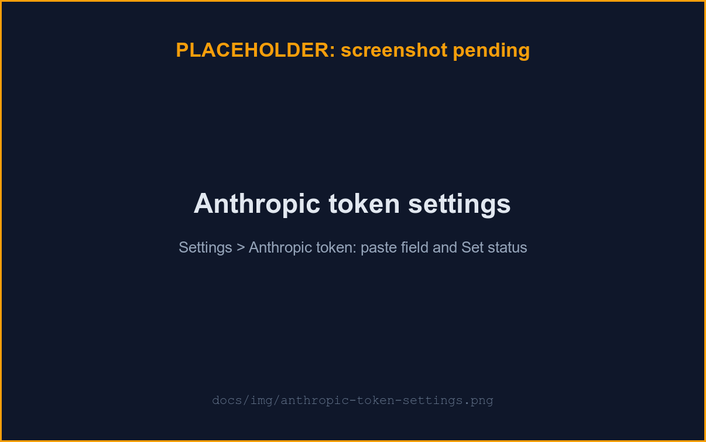

# Anthropic token

uzi runs your agents with **your own** Anthropic credential. Paste it once
in **Settings → Anthropic token**; uzi stores it encrypted and injects it
into your runs.

## Which credential to use

Prefer the first.

| Credential | How you get it | Best for |
|---|---|---|
| **OAuth token** (recommended) | `claude setup-token` (needs the Claude Code CLI and a Claude Pro/Max subscription login) | Anyone already on Claude Code; billed against your subscription. |
| **Console API key** | [console.anthropic.com](https://console.anthropic.com) → **API keys** → **Create key** | Anyone on usage-based API billing without a subscription. |

Both paste into the same field; uzi doesn't check for a particular prefix,
so either kind is accepted.

## 1. Mint a credential

- **OAuth token**: install the [Claude Code CLI](https://docs.claude.com/en/docs/claude-code/overview)
  if needed, then run `claude setup-token`. It opens your browser to sign
  in and prints a long-lived token to your terminal: copy it, then clear
  your terminal scrollback/history if it persists.
- **Console API key**: sign in at [console.anthropic.com](https://console.anthropic.com),
  open **API keys**, **Create key**, and copy it; the console shows it
  only once.

## 2. Store it in uzi

Open **Settings → Anthropic token**, paste it, and click **Save token**.
The status flips to **Set** with the save date; the token itself is never
shown again.

## Rotate or remove

- **Rotate**: paste a new token and click **Save new token**; it overwrites the old one.
- **Remove**: once a token is set, a **Delete** button appears next to its status; click it to disconnect uzi from your Anthropic account.

## Good to know

- **Encrypted, never returned.** uzi seals it at rest and never echoes it
  back in any response or log; see
  [ARCHITECTURE.md](../ARCHITECTURE.md#secrets-per-user-credentials-at-rest)
  for the mechanism.
- **Not verified at save time.** uzi doesn't call Anthropic when you paste
  it, so a bad or expired token only surfaces the first time an agent
  actually runs. Re-paste a fresh one if that happens.
- **Key rotation resets it.** If an operator rotates the server's master
  key, every stored token (yours included) must be re-pasted; see
  [configuration.md](./configuration.md).
