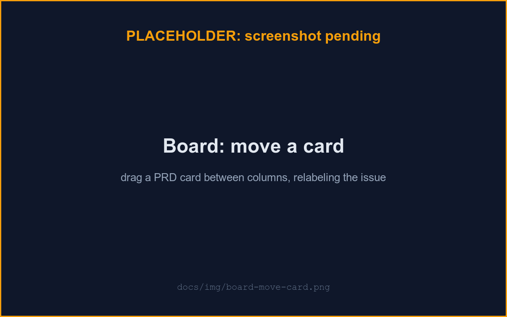

# Board

Each enabled repo gets a board in the sidebar: a kanban view of its GitLab
issues, kept in sync with the forge in both directions. Cards also carry
their latest agent run, so the board doubles as a run tracker: it moves
issues automatically as a run progresses and refreshes itself, without a
manual reload.

## Columns

- **Open** (implicit): issues carrying none of the configured column labels.
- One column per configured label (seeded on first open: `In Progress`,
  `Human Review`, `Upcoming`, `Later`); reconfigure any time from the
  board's column settings.
- **Closed** (implicit): the issue's GitLab state, not a label; cards here
  aren't draggable.

`In Progress` and `Human Review` are also the two columns the run automation
below moves cards through; `Upcoming`/`Later` are plain backlog buckets it
never touches except to restore a card to one.

## Move a card

Drag a card to another column. uzi writes the label change to GitLab first
(`add`/`remove` on that issue) and only updates the board once the forge
confirms it: a failed write snaps the card back rather than showing a move
that didn't really happen. The same change is visible in GitLab's own issue
and board views.

## Automatic moves

Starting a run moves its issue for you: **Start run** puts the card in **In
Progress**; when the run completes, it moves to **Human Review** (with or
without a merge request); a failed or cancelled run moves it back to
wherever it started (Open,
Upcoming, Later) rather than a hardcoded column, so a backlog placement is
never lost. A manual drag always wins — move a card by hand after a run has
started and automation leaves it alone from then on. Moves are best-effort
against the forge: one that fails (e.g. GitLab briefly unreachable) is
retried in the background for up to 30 minutes, without blocking the run.

## Run badges

Each card shows its latest run at a glance: **queued**/**claimed** while
waiting for a worker, **running Nm** (pulsing, worker name below), amber
**awaiting approval** (the loudest treatment — see Attention strip), rose
**failed** with the reason on hover, and neutral **stopped** for a
deliberate cancel or plan rejection (never styled as a failure). A completed
run with a merge request becomes an **`!N`** chip linking to it; without one
it's still a plain **completed** badge (never invisible). More than one run
on an issue adds a small **×N** count next to the badge — full history is
one click away (see Opening an issue).

## Attention strip

When any of your runs on this board is **awaiting approval**, a banner
appears above the columns linking straight to it — a human is the blocker
while a worker sits idle, so this is designed to be impossible to miss.

## Opening an issue

Click a card's title to open it in-app: full description, its column and
labels, and its complete run history (start time, duration, worker, MR
link). **Start run** is available there too. GitLab stays one click away via
the small icon next to the card's issue number.

## Staying in sync

Moves and edits made in GitLab appear in uzi within one poll interval;
de-labeling, closing, or deleting an issue appears within one (less
frequent) reconcile pass. The board also polls on its own (about every 10
seconds while the tab is visible), so run-driven moves and badges show up
without a manual **Refresh** — a brief toast ("#42 → Human Review")
announces each one. **Refresh** still triggers an immediate full sync if you
don't want to wait.

## Why only some issues show up

The board lists only issues carrying the **`PRD`** label (uzi works PRDs,
not arbitrary tickets). Each card also needs its issue description to link a
`prds/*.md` file; a card missing that link shows a warning badge and is
excluded from agent pickup until the link is added. A card carrying more
than one column label (edited outside uzi) shows a conflict badge and
displays in its highest-positioned column until the next move normalizes it.
