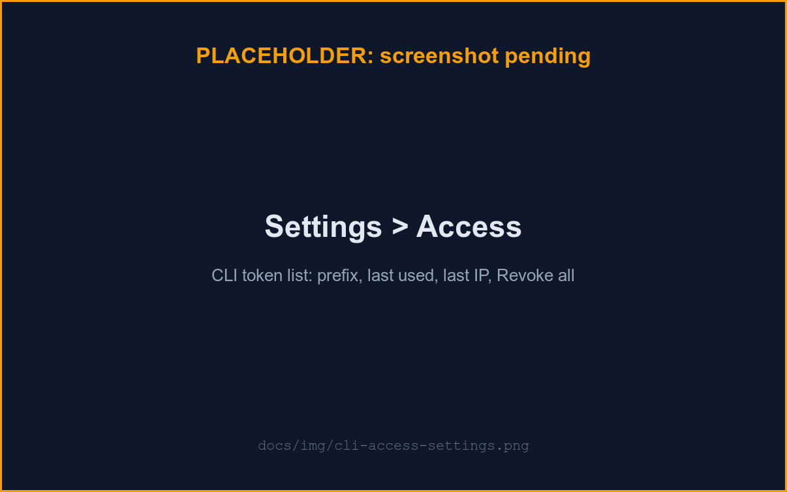

# uzi CLI

`uzi` is the terminal control surface for the factory: it drives the same API
the web UI does, so anything you can do in a browser you can do headless —
list and follow runs, approve or reject a plan gate, read the judge's review,
manage workers and repos, and (read-only) admin state. Built for humans
(tables on a TTY) and agents (`--json`, documented exit codes) alike.

## 1. Install

```sh
brew install vtmocanu/tap/uzi-cli
uzi version
```

The formula builds from source (`vtmocanu/uzi` is a private repo), so you need
**group-read on `vtmocanu/uzi`** — unlike a public tap, `brew install` clones
the product repo over git-over-SSH using your own key.

On first run the CLI also drops a Claude Code skill at
`~/.claude/skills/uzi-cli/SKILL.md` (generated from the binary's own command
tree, so it never drifts). No manual step is needed, but you can force a
refresh — e.g. right after upgrading — with `uzi skill install --force`, and
check it with `uzi skill status` (details under **Bundled skill and
session-start hook**, below).

## 2. Point it at your instance

Every command needs a base URL: pass `--url`, set `$UZI_URL`, or run
`uzi login` (below), which saves it for you. Only `https://` URLs are
accepted — plus plain `http://` on `127.0.0.1`/`localhost`, for a local
compose stack — so a credential is never sent in the clear.

## 3. Authenticate

Two paths, one credential.

**Human — `uzi login`.** Browser-brokered, no loopback listener, so it works
over SSH and in containers:

```sh
uzi login
```

It prints a one-time code and a URL, opens your browser to **Approve CLI
login**, and waits. Type the code from your terminal, pick a scope, and
approve — the CLI's token is saved to `~/.config/uzi/credentials.toml`
(0600) the moment you do.

**Agent or CI — a static token.** Mint one in **Settings → Access**, copy it
once (it's shown exactly once), and set it:

```sh
export UZI_URL=https://your-uzi-instance
export UZI_TOKEN=uzc_...
uzi run list --json
```

`UZI_URL`/`UZI_TOKEN` need no `$HOME`, no browser, no cookie — the whole
headless path. **In GitLab CI, `UZI_TOKEN` must be a masked variable.**

## Commands

```
uzi login | logout | auth token [--with-token] | auth status | whoami
uzi run list | get <id> | logs <id> [--follow] [--after <seq>]
uzi run create --repo <id> --issue <iid>
uzi run approve <id> [--agent-source own|repo] [--exclude-agents a,b]
uzi run reject <id> [--message <text>]
uzi run cancel <id>
uzi run follow-up <id> [--message <text>]
uzi run inputs <id> [--json]
uzi review show <id> | backlog [--bucket todo|filed|done|dismissed|all]
uzi review resolve <id> <rec> | --category <c> --target <t>
uzi review dismiss <id> <rec> | --category <c> --target <t> --reason wont-do|not-an-issue
uzi review undo <id> <rec> | stats [--json]
uzi token list
uzi worker list | rm <id> | set-token <worker-id> <label> | set-token <worker-id> --default
uzi repo list
uzi admin users | runs | workers | usage | rate-limits
uzi skill status | install [--force] | install-hook | uninstall-hook
uzi tui [run-id]
uzi version
```

Global flags: `--json`, `--url <url>`, `--quiet`, `--no-color`.

A few worth knowing:

- **No `worker create` and no `admin` writes.** Minting a worker join token
  returns a credential that reads decrypted secrets, and every admin write
  stays cookie-only — both are web UI actions by design.
- **`token` is list-only, and `worker set-token` is the one write near it.**
  See [Anthropic tokens](#anthropic-tokens) below for why the split falls
  exactly there.
- **`run approve` picks the subagent roster explicitly.** By default a run
  uses its own default roster; `--agent-source own|repo` overrides it
  (`own` = your template roster, `repo` = the agents the worker detected in
  the clone's `.claude/agents/`), and `--exclude-agents a,b` drops individual
  subagents from that source. `--exclude-agents` requires `--agent-source`.
- **`review show <id>`** (formerly `run review <id>`, still around as a
  hidden, deprecated alias) prints the judge's verdict, summary,
  recommendations, and triage tally for a run — see
  [Run judge](./judge.md#reading-a-review-from-the-cli) for the full `--json`
  contract. The rest of the `review` group (`backlog`/`resolve`/`dismiss`/
  `undo`/`stats`) triages recommendations, per run or across all of them — see
  [Reviewing and triaging from the CLI](#reviewing-and-triaging-from-the-cli)
  below. There's still no `rejudge` verb: re-running the judge spends the
  owner's Anthropic budget and stays a web action.
- **`run inputs <id>`** lists the steer queue — a table of `body` / `state`
  / `age`, newest first — same delivery states as the web pane, see
  [Run activity pane](./run-activity.md#steer-queue). `--json` prints the raw
  DTO instead. **Chat caveat**: a chat run seeds every turn as a follow-up
  row, so `run inputs` against a chat run lists the whole conversation, not
  just steering messages; an issue or CI-fix run's queue starts empty and
  only ever holds what you actually sent mid-run.
- **`run logs <id>` names the invocation, not just the role.** The actor
  column reads `role[/<short id>][ · <task label>]`, so two `coder`
  subagents running in parallel are distinguishable instead of being two
  identical `coder` rows:

  ```
  #12   tool_use         coder/3v6ptu · API wiring          {"name":"Edit"}
  #13   tool_use         coder/2k9xqf · web gate UX         {"name":"Write"}
  #14   text             lead                               {"text":"delegating"}
  ```

  The short id is the **last** 6 characters of the invocation id, not the
  first — these ids share a constant prefix, so a leading slice would render
  every instance identically. A message with no invocation (the lead's own
  turns, infra frames, and anything from before this shipped) prints the bare
  role, with no `/id` and no `· label` — note the actor column itself is
  wider than it used to be, so the payload column of *every* line has moved.
  The cell is capped and the label truncated so the payload column stays
  aligned (single-width characters — a CJK label still occupies two terminal
  columns per rune, which this tool does not model).

  `--json` carries the stored invocation id and label in full, with no
  CLI-side truncation — but note the **server caps the label at 80 runes on
  write, and appends no ellipsis**, so a longer label was already shortened
  before the CLI ever saw it, with nothing in the value marking the cut. Both
  fields are always present in `--json`, `null` when absent:

  ```jsonc
  {"seq":12,"kind":"tool_use","agent":"coder",
   "agent_instance":"toolu_01AAAAAAAAAAAAAAAA3v6ptu","agent_label":"API wiring", ...}
  ```

  These two keys are the same per-invocation attribution the web pane draws
  its lanes from — see
  [Run activity pane](./run-activity.md#lanes-one-per-actor-not-one-per-turn).
- **`admin` needs an admin-scoped token.** A default (`uzc_`) token gets
  exit 3 with an actionable message; mint an `admin_ro` (`uza_`) token in
  Settings → Access to use it. `uzi whoami` over a `uzc_` token reports
  `is_admin: false` even for an admin — that's the credential's own
  authority, not your résumé.
- **`uzi logout` is local-only.** It removes the stored credential; it does
  **not** revoke it server-side (see [Managing tokens](#managing-tokens)
  below).

## Watching runs live: `uzi tui`

```sh
uzi tui            # board — a live view of your own runs
uzi tui <run-id>   # jump straight into one run's lanes
```

A full-screen, keyboard-driven view of the factory: a board that updates
itself, a drill-in showing what each subagent is doing right now, and
in-place steering — all without leaving the keyboard. It needs an
interactive terminal; run it against a pipe or in CI and it exits with a
usage error pointing at `run list --json` and `run logs --follow` instead of
drawing escape codes into your log.

**This doesn't replace `run logs --follow`.** The TUI is for a human at a
keyboard; `--follow` (with `--json` for NDJSON, `--after <seq>` to resume,
and stop-on-terminal-status) stays the scriptable, single-run surface and is
also the TUI's own fallback when the live channel is unreachable (below).

### Three views

- **Board** (the default). Your own runs, refreshed on a poll — a live list
  doesn't need a socket per row, so this is the one screen that doesn't use
  the live channel. `[a]` toggles the factory-wide admin board (needs a
  `uza_` token; a `uzc_` token gets refused inline and stays on your own
  runs, never a crash). **The admin board isn't your own-runs list widened —
  it's a different shape**: active runs only (nothing completed), capped at
  500, no judge-verdict or usage columns, titled "active runs (factory-wide)"
  on screen so it never promises a row it can't show.
- **Run detail** (`[enter]` from the board, or `uzi tui <run-id>` directly).
  A left rail of agent lanes — the lead plus each live subagent, one lane per
  invocation, each with a status dot — beside the selected lane's transcript,
  rendered as markdown. Lanes are built from the same per-invocation
  `agent`/`agent_instance`/`agent_label` attribution `run logs` prints; see
  [Run activity pane](./run-activity.md#lanes-one-per-actor-not-one-per-turn)
  for what a lane's dot means.
- **Review overlay** (`[v]` from run detail). The judge's verdict, summary,
  and recommendations, with the same resolve/dismiss/undo triage described
  under [Reviewing and triaging from the CLI](#reviewing-and-triaging-from-the-cli).

### Keybindings

```
j/k, ↓/↑     move (board: row · detail: scroll the transcript)
tab, h/l     switch lane (detail view only; h/← previous, tab/l/→ next)
enter        open the selected run (board)
/            filter the board
a            toggle the factory-wide admin board (board only)
r            refresh
v            open/close the review overlay (detail)
f            start a follow-up (detail, owner only)
y/n          approve/reject, at a plan gate (detail, owner only)
x            cancel the run, asks to confirm (detail, owner only)
esc          back out / dismiss
?            this help
q            quit — asks to confirm; a second ctrl+c quits at once
```

Note what isn't here: there's no `[a]`-for-approve and no bare `[q]`-quits —
early drafts of this feature used both, but `[a]` doubling as admin-toggle
*and* approve would put "approve a plan" one keystroke from `[x]` cancel on
a live run, so approve/reject moved to `y`/`n` and `a` stayed admin-only.
Quitting always asks first (`q` or `ctrl+c`); a second `ctrl+c` is the
escape hatch when the confirm prompt itself is what's stuck.

### Steering is run-level, not per-agent

The steer bar sends `follow_up`, `approve_plan`, `reject_plan`, or `cancel`
to the **run** — there's no wire to whisper to one live subagent. The lane
rail is where you *watch* per-agent activity; the run (and its lead, who
then directs its own subagents) is what you *steer*. A queued/delivered
indicator above the bar reflects the same steer queue `uzi run inputs`
prints.

### Who can steer what

The steer bar only appears when you own the run — an admin who opens
someone else's run through `[a]` sees the transcript, lanes, and review
render normally, but the steer bar and queue indicator are replaced with a
one-line reason instead of controls that would 404. Ownership is checked by
asking the server (the same read the steer write itself scopes by), not by
comparing ids client-side, so the two can't drift apart.

**`uzi tui <chat-run>` opens and is read-only, on purpose.** Chat runs never
appear on the board — you can only reach one by id — and the TUI always
suppresses the steer bar for `kind=chat`: a chat follow-up is a
forge-minting action that belongs to the web's guarded, cookie-only chat
surface, and the plain run-input write doesn't know to keep a raw follow-up
out of it. Watching a chat run's transcript and lanes still works.

### The live channel and degradation

Run detail subscribes to the same `/api/ws` hub the web run view rides,
now reachable with a Bearer CLI token (`uzc_`/`uza_`) as well as a browser
session — that's the one backend change this feature needed; per-run
authorization (owner-or-admin) and the socket's origin check are both
unchanged. If the socket can't be opened or drops, the view falls back to a
plain 2s REST poll — the same cadence `run logs --follow` uses — and says so
on screen rather than freezing silently. A non-TTY stdout is refused up
front, before anything tries to draw (see above).

## Reviewing and triaging from the CLI

`uzi review` reads a run's judge output and sets the same **Mark done** /
**Dismiss** triage the [run judge](./judge.md#triage-resolve-dismiss-and-count)
page does, from the terminal:

```sh
uzi review show <run-id>                                    # verdict + recommendations + triage
uzi review resolve <run-id> <rec-id>                         # mark a recommendation done
uzi review dismiss <run-id> <rec-id> --reason wont-do        # valid, not worth doing
uzi review dismiss <run-id> <rec-id> --reason not-an-issue   # false positive
uzi review undo <run-id> <rec-id>                            # clear a disposition
uzi review stats [--json]                                    # your triage tally, across all runs
```

`show` is one run. `backlog` is every recommendation across **all** your runs,
deduped by `(category, target)`, so one that recurs in five runs is a single
row reading `seen in 5 runs` — the terminal form of the
[Judge menu](./judge-menu.md):

```sh
uzi review backlog                                           # what still needs triage
uzi review backlog --bucket all --json                       # settled groups too, for an agent
uzi review backlog --run <run-id>                            # only coordinates that recur in that run
uzi review resolve --category <c> --target <t>               # mark the whole group done
uzi review dismiss --category <c> --target <t> --reason wont-do
```

Three things to know before acting on a group action's output:

- **`updated` counts coordinates, not recommendations.** One review can carry
  the same `(category, target)` twice and both share a single disposition row,
  so dismissing a group of 5 can correctly report 4.
- **`updated: 0` succeeded and wrote nothing**, and *why* is deliberately
  unknowable: a coordinate that doesn't exist, one already settled, and one
  belonging to another user are the same answer, so nothing leaks whether it
  exists. Re-read `backlog` rather than guessing.
- **`truncated: true` means a missing group is unknown, not settled** — the row
  cap applies before grouping, so a surviving group's counts can be understated
  too. Narrow with **`--run <run-id>`**: the anchor is the only filter applied
  *before* the cap, so it is the only one that changes what gets cut. `--bucket`
  filters the surviving rows and cannot reach the missing ones. The `triage` tally is exempt: it's the canonical all-time aggregate and
  matches `uzi review stats` and the web nav badge exactly.

Passing only one of `--category`/`--target` is a usage error (exit 2). An empty
half is a literal empty string, not a wildcard, so sending it would report a
successful no-op. Filing an issue from a recommendation stays a web action:
there is no `file` verb.

`<rec-id>` is the short, git-style id `show` prints as the first column of
each recommendation (or the full UUID from `--json`); an unambiguous prefix
resolves against the run's **current** review, so you can paste straight out
of `show`'s output. An ambiguous prefix is a usage error (exit 2, "use a
longer id"); an id that matches nothing is a not-found (exit 4) with a
refresh hint — the review may have changed under a re-judge.
`dismiss` requires `--reason wont-do` or `--reason not-an-issue`; anything
else is a usage error (exit 2), raised before any request is sent. `undo` on
a recommendation with no disposition is treated as already-undone (a
friendly line, exit 0), not a failure.

`uzi run review <id>` still works — it's a hidden, deprecated alias for
`uzi review show <id>`.

**The mutation verbs are owner-only, whatever the token.** A `uzc_` token
drives `resolve`/`dismiss`/`undo`/`stats` on its own runs, same as clicking
the buttons yourself. A read-only `uza_` token can `show` anyone's review
(the same admin reach other judge reads get) and `stats` always reports the
token owner's *own* tally, but the read-only ceiling still holds for writes:
the **per-run** `resolve`/`dismiss`/`undo` against **another** user's review is
refused (exit 4, not found), exactly as for a non-admin `uzc_` token. On its
**own** runs, though, a `uza_` token can triage same as any owner — the
ceiling blocks reaching into someone else's review, not every write
everywhere.

The **group** form is owner-only too, but it refuses *silently* rather than
with a 404, and the difference is a contract, not an oversight. Its unit is a
`(category, target)` coordinate, not an id, so there is nothing to report as
not-found: another user's coordinate simply resolves to zero of *your* rows and
comes back `200`, `updated: 0` — the same answer a misspelt or already-settled
coordinate gives. That indistinguishability is the point; a per-item outcome
would rebuild exactly the existence oracle the 404-on-everything rule removes.
Don't read `updated: 0` as an error, and don't read it as success either.

## Anthropic tokens

You can hold several named [Anthropic credentials](./anthropic-token.md) and
point individual workers at them. The CLI can **read** that set and **move a
worker between its members** — it cannot change the set itself:

```sh
uzi token list                                 # labels, default flag, timestamps
uzi worker set-token <worker-id> console-key   # bind a worker to a named token
uzi worker set-token <worker-id> --default     # clear the binding
```

`set-token` takes a **label** (the name from `token list`), not an id, and
takes effect on that worker's next claim — no restart and no re-minted join
token. Passing both a label and `--default`, or neither, is a usage error
(exit 2) rather than a guess; an unknown label is refused rather than stored.
A bound worker's **chat** runs still spend your default token: the binding
covers the run lane only.

**Adding, renaming, re-defaulting and deleting a token are web-only, and
that is a security boundary rather than an unfinished feature.** A CLI token
is a bearer credential — a stolen `uzc_` is meant to be able to read and to
drive runs, but never to *replace the credentials it runs on*. If token
writes were reachable over Bearer auth, an attacker holding a leaked `uzc_`
could swap a user's Anthropic credential for their own and quietly redirect
every future run's spend. That is exactly the escalation the split prevents,
and it is the same reasoning that keeps `worker create` out of the CLI.
`set-token` sits on the allowed side because it mints nothing and hands back
no credential: it re-points a worker between tokens the caller already owns.

**Driving the API directly?** The old kind-path routes still work as
deprecated aliases over your *default* token: `PUT
/api/me/secrets/anthropic_token` rotates-or-creates it, and `DELETE
/api/me/secrets/anthropic_token` removes it. The DELETE alias now answers
**409** once you hold more than one token, because "delete the anthropic
token" stopped naming one row — delete by id instead
(`DELETE /api/me/secrets/anthropic_token/{id}`). All of these are cookie-only,
for the reason above.

## Agents: `--json` and exit codes

Every command prints a human table by default; pass `--json` for a stable
document instead. A pipe does **not** auto-switch formats — that would be a
silent contract change — so an agent always passes `--json` explicitly.

| Code | Meaning |
|---|---|
| 0 | success |
| 1 | generic error |
| 2 | usage error (bad flags/args) |
| 3 | auth required / invalid / wrong scope |
| 4 | not found |
| 5 | conflict (e.g. the run already finished) |
| 6 | server unreachable / 5xx |

Branch on the exit code, not on stderr text — the wording is for humans and
can change. There's also no `--token` flag: a credential must never land on
`argv`, readable via `ps`/`/proc`. Use `$UZI_TOKEN`, or `uzi auth token`,
which reads a token from stdin.

## Bundled skill and session-start hook

**The skill itself.** The CLI installs (and self-upgrades)
`~/.claude/skills/uzi-cli/SKILL.md` on first run, generated from the binary's
own command tree — it never drifts from the CLI you actually have installed.
Every `uzi` command refreshes it best-effort before it runs (set
`UZI_SKILL_AUTO_UPGRADE=0` to disable that). `uzi skill install [--force]`
refreshes it explicitly — `--force` overwrites even a file you edited (your
edit is preserved to `SKILL.md.bak` first) — and `uzi skill status` reports
its path and whether it's installed and current.

**The session-start hook, opt-in.** The per-command refresh above only helps
once a `uzi` command has run — right after `brew upgrade uzi-cli`, a fresh
Claude Code session can still read the OLD skill before that happens. Run
`uzi skill install-hook` to narrow that window: it wires a Claude Code
`SessionStart` hook into `~/.claude/settings.json` whose command is
`uzi skill install`, so the skill is refreshed at session start rather than
waiting for your next `uzi` command.

The write is surgical and non-destructive:

- **Opt-in.** Nothing installs this for you; you run it yourself, once.
- **Merged, not clobbered.** It adds just our one hook entry to
  `~/.claude/settings.json`, alongside any hooks other tools already put
  there — those are left untouched.
- **Backed up first.** The prior file is copied to `settings.json.bak` before
  the first write.
- **Abort on malformed JSON.** If `settings.json` exists but doesn't parse,
  `install-hook`/`uninstall-hook` refuse to touch it rather than risk
  clobbering a hand-maintained file.
- **Idempotent.** Running `uzi skill install-hook` again is a no-op — it
  detects the hook is already present.
- **Visible in status.** `uzi skill status` (and `--json`) reports whether
  the hook is installed and current, alongside the skill's own state.
- **Reversible.** `uzi skill uninstall-hook` removes it, leaving every
  sibling hook intact.

The hook is best-effort and near-free to run: a failed refresh never blocks
session start, and `uzi skill install` is a version-gated no-op once the
skill is already current, so the hook costs almost nothing on a normal
session start.

## Config and credentials

`~/.config/uzi/config.toml` (URL, 0644) and `credentials.toml` (token, 0600 —
the CLI refuses to read it if it's group/world-readable). `$UZI_URL` and
`$UZI_TOKEN` override both files, which is why the headless path needs
neither.

⚠️ This path is fixed at `~/.config/uzi/` and does not honour
`$XDG_CONFIG_HOME` — deliberately: on at least one machine on this team that
variable points into a git-tracked, synced directory, and honouring it would
write a live token into version control.

## Managing tokens

> **A password change is NOT an incident-response control for CLI tokens. You
> must enumerate and revoke each one.**

If a laptop is lost, **Settings → Access → Revoke all** is the one-click
answer — it stops every `uzi` CLI and CI job using one of your tokens at
once. If you'd rather keep some, the token list gives you what you need to
decide: `token_prefix`, `last_used_at`, and `last_used_ip`. Revoke anything
you don't recognise, and treat an unfamiliar `last_used_ip` as the signal to
revoke, not just a curiosity.



There is no per-request audit log for CLI tokens — `last_used_ip` (updated at
most once a minute) is the only detection control the design has, not a full
trail.
