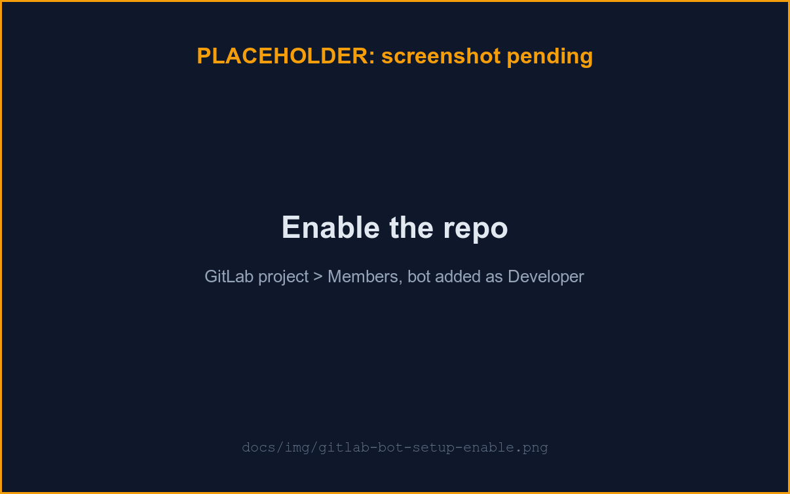
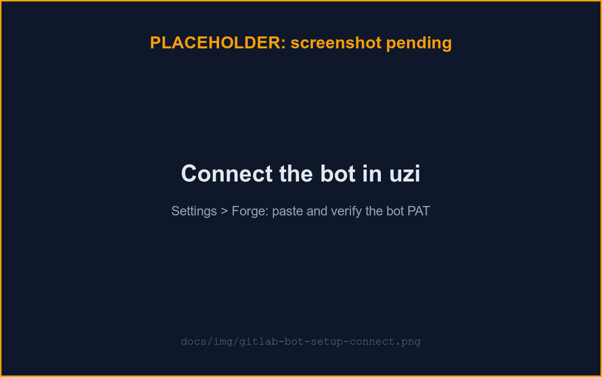

# GitLab bot setup

uzi acts on the forge as **your own bot account**, never your personal identity: a revocable, individually-scoped identity instead of one shared credential. See [ARCHITECTURE.md](../ARCHITECTURE.md#forge-integration) for why.

## 1. Create the bot account

If self-registration is open on your GitLab instance, register a second account for the bot yourself (e.g. `uzi-bot-<yourname>`). If it's closed, ask an instance admin to create it for you, either by hand or by running `scripts/create-gitlab-bot.sh <bot-username> <group/project>`, which creates the bot, mints its PAT, and adds it as Developer in one shot.

## 2. Create a personal access token

If you provisioned the bot yourself, create its token from the bot account's **Settings → Access Tokens**:

- **Scope: exactly `api`**, not `read_api` (moving a card in uzi writes labels, and `read_api` is read-only) and nothing *more* than `api` either — uzi rejects an over-scoped token (see [Least privilege](#least-privilege-what-uzi-verifies) below).
- **Expiry**: as short as your workflow tolerates. uzi warns on the connection card once the token is within 14 days of expiring, but rotate before it lapses — an expired token stops all sync.

## 3. Add the bot to your project

Project → **Manage → Members → Invite members**, add the bot with role **Developer** (not Reporter, not Maintainer). Developer is a hard requirement: uzi's project discovery only sees projects where the bot has at least Developer access.

## 4. Connect the bot in uzi

1. Log in and open **Settings → Forge**.
2. Pick a base URL: only the operator-configured allowlist is offered (the SSRF guard; see [ARCHITECTURE.md](../ARCHITECTURE.md#forge-integration)).
3. Paste the bot's PAT and submit. uzi verifies it immediately, runs the least-privilege token check (see below), and shows the bot's username; the token itself is never shown again. An **over-privileged** token is rejected here and nothing is stored — mint a clean one and retry.

## 5. Enable the repo

Open **Boards**, pick the connection, and enable each project you added the bot to. This makes its board appear in the sidebar and starts syncing its `PRD`-labeled issues (see [Board](./board.md)).

If verification fails, check: the PAT's scope is `api`, it hasn't expired, and the bot is at least Developer on the target project.

A connection also has a **"Your forge identity (for autopilot)"** field, separate from the bot's own credential — it's how uzi maps a label added on GitLab back to you. See [Autopilot](./autopilot.md).

## Protect your main branch

If you'll run agents against a project, protect its default branch (**Settings → Repository → Protected branches**): allow only Maintainer+ to merge or push. Because the bot is Developer-only, it can open a merge request but can never merge or push there itself: the platform-enforced half of uzi's ["an agent can only ever open an MR" guarantee](../ARCHITECTURE.md#guardrail-layers-the-primary-directive).

## Least privilege: what uzi verifies

uzi does not just document the "bot = Developer, `main` protected" rule — it **checks** it, so drift (someone bumps the bot to Maintainer, unprotects main, or swaps in a fatter token) becomes visible instead of silently voiding [the GitLab-side guardrail layer](../ARCHITECTURE.md#guardrail-layers-the-primary-directive). The requirements:

- **Token scope is exactly `api`.** Fewer scopes would not work at all; anything more (`sudo`, `read_user`, a second scope) is over-privilege.
- **The bot is not an instance admin.** An admin PAT is effectively god-mode regardless of scope.
- **The token is active and unexpired.** Expiry within 14 days is a warning (advance notice), not a block.
- **On every enabled repo, the bot's effective role is exactly Developer (access level 30).** Maintainer/Owner (≥ 40) can push protected branches and edit repo settings; below Developer (or no membership at all) breaks sync.
- **The repo's default branch is protected and not Developer-pushable.** A protected `main` that still admits Developer push protects nothing.

**When uzi checks:**

- **At connect (blocking).** The token-level checks (scope, admin, active, expiry) run when you save a PAT; an over-privilege *violation* returns `422` with the exact reasons and **stores nothing** — the one moment uzi holds the plaintext and you are present to fix it.
- **On demand.** Settings → Forge → **Check privileges** runs the full report (token + every enabled repo) and refreshes the badges.
- **Periodically.** A background sweep (default daily, `UZI_PRIVILEGE_CHECK_INTERVAL`) re-runs everything, so drift surfaces within one interval without anyone asking.

Findings show as a per-connection badge (`least-privilege ✓` / `N warnings` / `N violations` / `unchecked`) expandable to the finding list, plus per-repo badges on the Boards page. Per-repo findings **warn** and never block sync — membership changes happen on the forge after connect, and blocking sync over a role finding would punish the wrong action.

**Limitation — group-level push grants.** uzi flags a *direct, per-user* allow-to-push grant that names the bot on a protected branch, but it does **not** detect a push grant the bot inherits via a **group** it belongs to (that needs an extra group-membership lookup, deferred). If you use group-based protected-branch push rules, audit them manually: a group the bot belongs to must not appear in the branch's allowed-to-push list.

For scripting these steps with `glab` and the E2E test bot convention, see [Developer conventions](./dev-conventions.md).
