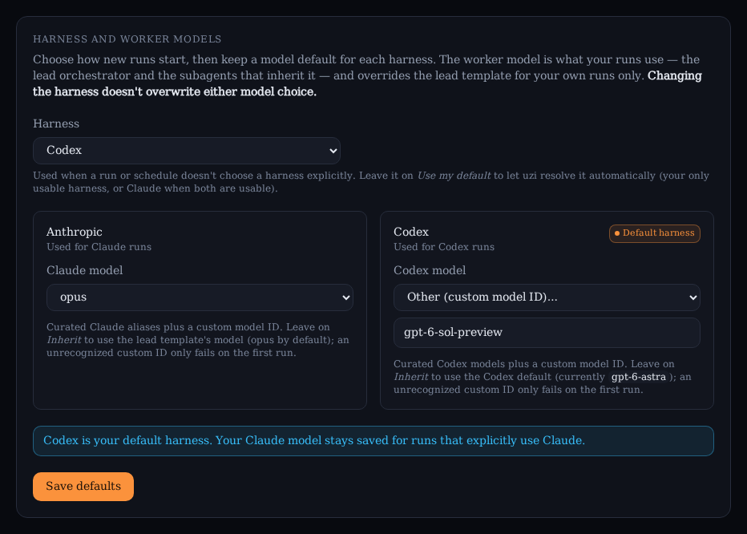

# Worker model

Pick which Claude model your own runs use, overriding the `lead` [agent
template](./agent-templates.md)'s model just for you. Other users' runs are
unaffected.

## Model precedence

For your runs (the lead orchestrator, and any subagent whose own template
leaves `model` unset), uzi resolves the model in this order:

1. The **schedule's model**, if the run was started by a
   [schedule](./scheduling.md) that pins one.
2. Your **Worker model** setting below, if set.
3. The `lead` template's `model` (`opus` by default).
4. Whatever the Claude Agent SDK/your Anthropic account defaults to.

A subagent with its own `model` override always uses that, regardless of the
schedule model or your setting.

## Set your worker model

1. Open **Settings → Worker model**.
2. Pick a curated alias (`opus`, `sonnet`, `haiku`, `fable`), or choose
   **Other** and paste a full model ID.
3. Click **Save model**. It applies starting with your next run.

Leave it on **Inherit** (the default) to fall back to the `lead` template's
model.

## Per-schedule model

A [schedule](./scheduling.md) can run on its own model without changing your
global Worker model — handy for a cheap recurring bot (e.g. a nightly
"propose a feature" run on `fable`) while your interactive runs stay on your
normal model.

Set it in the schedule's create/edit form, in the **Model (optional)**
control, or with `uzi schedule create --model <alias|id>`. Leaving it on
Inherit uses your Worker model. The model a scheduled run actually used is
shown on that run's detail page and by `uzi run get`. Same validation as the
Worker model above (single token, at most 100 characters; blank means
inherit).

## Good to know

- **Not verified at save time.** uzi doesn't check a custom model ID against
  Anthropic; an unrecognized one only fails on your first run, surfaced in
  that run's messages like any other agent error.
- **Validation.** A model must be a single token: trimmed, no interior
  spaces or control characters, at most 100 characters. Blank means inherit.
- **Yours alone.** This setting only changes runs you own; it never affects
  other users or the shared `lead` template.
- **Separate from the judge model.** The [run judge](./judge.md) runs on its
  own model, set instance-wide by an admin (a cheap alias by default) — your
  Worker model setting here has no effect on it.
