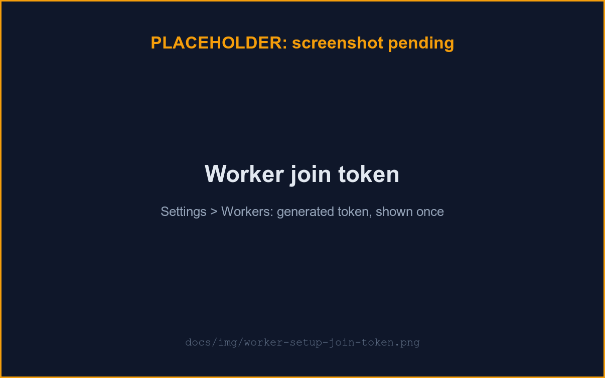

# Worker setup

A **worker** is the `uzi-agent` container: it connects to your uzi server, claims your queued runs, and drives them with the Claude Agent SDK. One worker per user is normal; it runs anywhere that can reach the server outbound (laptop, VM, CI runner), since it never needs an inbound port.

## 1. Generate a join token

In uzi, open **Settings → Workers** and register a worker (give it a name, e.g. `laptop`). The join token is shown **once**: copy it now, since only its hash is stored server-side (register a new worker if you lose it).



## 2. Anthropic credential

The worker runs agents against your own Anthropic credential, which must already be saved in uzi: see [Anthropic token](./anthropic-token.md). It's decrypted server-side and handed to the worker only inside a run's claim response, never stored on the worker beyond that run.

## 3. Run the worker

**Bundled compose profile** (the common case): set `UZI_WORKER_TOKEN=<join token>` in your `.env` (see [configuration.md](./configuration.md)), then:

```sh
docker compose --profile agent up
```

This starts the `agent` service pointed at the compose network's `api`, with its data on the named volume `agentdata`. Once it registers, **Settings → Workers** shows it as **online**.

**Standalone**, for a different host or a remote server (note the `-f` selecting the template Dockerfile, see [Worker templates](#worker-templates) below):

```sh
docker build -t uzi-agent -f agent/templates/base/Dockerfile agent
docker run -d -e UZI_API_URL=https://uzi.example.com -e UZI_WORKER_TOKEN=<the join token> \
  -v uzi-agent-data:/data --cap-drop ALL --security-opt no-new-privileges:true uzi-agent
```

Put a TLS-terminating proxy in front of a worker reached over an untrusted network: `api` itself listens plain HTTP.

## Worker templates

A worker image is built from a **template**: a curated, code-reviewed Dockerfile under `agent/templates/<name>/`. Templates exist for heavy or system-level dependencies a per-repo tool provisioner can't supply well (a JDK, system libraries); everyday CLI tools belong to the repo, not the image. Two ship today:

| Template | What it adds | Use it when |
|---|---|---|
| `base` (default) | Node 22 + git + bash — the minimal worker | Most repos |
| `jvm` | `base` plus a JDK (`java`/`javac`) | Repos that build or test Java |

Pick a template at build time with the `WORKER_TEMPLATE` variable, which selects `agent/templates/<name>/Dockerfile`:

```sh
WORKER_TEMPLATE=jvm docker compose --profile agent build agent
WORKER_TEMPLATE=jvm docker compose --profile agent up
```

With `WORKER_TEMPLATE` unset, compose builds `base`. Set it to a **bare template name** only (one of the names above): it is interpolated into the Dockerfile path, so a value with `/`, `..`, or an absolute path is unsupported and would resolve outside `agent/templates/`. Standalone, point `docker build -f` at the template's Dockerfile (e.g. `-f agent/templates/jvm/Dockerfile agent`).

Each template's Dockerfile bakes its own name into the image as `UZI_WORKER_TEMPLATE` (a fixed literal, independent of the `WORKER_TEMPLATE` build variable), and the worker **reports** that at register, so **Settings → Workers** shows each worker's template. Because the reported value is the image's own baked-in identity, it flags a genuine mismatch when you build with one `WORKER_TEMPLATE` but declared another at issuance. This is observability only: the join token is still the sole trust anchor, so a worker's reported template is never used to accept or reject it.

## Tool provisioning

Beyond the image's baked-in tools, a run can install **per-repo CLI tools** (kubectl, terraform, jq, and so on) on demand with [devbox](https://www.jetify.com/devbox) (nix under the hood). Users set a repo's tool profile, opt into a repo's own `devbox.json`, and admins manage the allowlist — all covered in [Per-repo tools](./worker-tools.md). The operator points to know:

- **New outbound egress.** Installing tools reaches **nix substituters** (`https://cache.nixos.org` plus any you configure) — the one *new* egress this feature adds. A worker also reaches the forge directly for git (clone/fetch/push), so its full outbound set is `api` + the forge + the substituters. Allow the substituters through an egress firewall if you run one.
- **Provisioning is secret-scrubbed.** The install runs in a subprocess stripped of the forge token, the Anthropic token, and the join token, so a package's build hook cannot read your credentials. Only an explicit allowlist of tool environment variables (`PATH` and nix's TLS/locale vars) is passed back to the agent.
- **Provisioning failure fails the run** with a clear message rather than silently continuing without the tool.

The worker image installs a **pinned** devbox binary and nix at build time (no floating installer, no first-run download). Storage: the nix store is the `agentnix` volume at `/nix`; devbox/nix per-user metadata lands HOME-derived under `/data` (the `agentdata` volume). Both persist across `docker compose down`/`up`, so only a fresh `down -v` re-downloads packages.

## Online, offline, busy

- **online**: a recent heartbeat arrived within the server's staleness window.
- **offline**: no heartbeat in time; the server re-queues any run the worker was holding.
- **busy**: the worker holds one or more non-terminal runs — by default just one at a
  time; see [Concurrent runs](#concurrent-runs) to raise that.

## Concurrent runs

By default a worker executes one run at a time. Set `WORKER_MAX_CONCURRENT_RUNS`
above 1 (see [configuration.md](./configuration.md)) to let it run several runs
concurrently, each in its own slot. A slot is roughly one SDK CLI process, its git
operations, and any devbox tool provisioning it triggers — size the cap to what the
host can actually run at once; the worker still honors a value above the soft
ceiling of 8, but warns at boot that it probably shouldn't. The cap is worker-side
only: it's reported at registration so **Settings → Workers** can show `active/cap`,
but the server never enforces it.

A run parked at the plan-approval gate holds its slot for the whole wait, up to
`WORKER_PLAN_APPROVAL_TIMEOUT` (default 24h) — approve your plans, since an
unapproved one pins a slot until it times out. At the default cap of 1 that's
already today's behavior.

Raising the cap is an informed trade-off, not a free speedup:

- **A live sibling run can briefly read a push in progress.** Runs share the same
  container user, so a concurrent run's agent can read another run's git-push
  child's environment (and its credential) during that run's short push window.
  `main` stays protected by GitLab's branch protection either way; this narrows a
  defense-in-depth layer, not the primary one.
- **Bash isn't jailed to its own worktree.** The guardrail denies push and
  credential-reading commands but not writes outside a run's own worktree, so a
  prompt-injected run could shell-write into a sibling's worktree or the shared
  bare-repo cache.
- **One container, one memory budget.** A runaway run can OOM the whole container,
  requeuing every in-flight run together; raise `RUN_MAX_REQUEUES` (default 1)
  alongside any cap above 1 so an innocent sibling isn't failed outright by another
  run's crash.
- **One Anthropic token, N runs.** Every slot shares your Anthropic token, so a
  higher cap multiplies 429 pressure on it — the SDK's own retry/backoff is the
  only mitigation today.
- **Same-repo runs still serialize.** Two concurrent runs against the same repo
  queue behind each other at the git layer — correct, just not actually parallel.

These are same-uid, single-container specifics; the design behind this feature
(`adr/0042-worker-run-concurrency.md`) has the full research and the
container-per-run model that eventually closes them.

## Multiple workers, removing a worker

Register more than one worker (e.g. `laptop` and `ci-runner-1`); each claims independently from your queue. **Settings → Workers → Delete** removes a registration (refused while it holds a non-terminal run); it doesn't stop the container itself.

## Seeing raw run events

The run view shows a terse, readable feed, not raw JSON. To watch the complete raw events a run emits (every tool call, tool result, and status frame), start the worker with `UZI_LOG_LEVEL=debug` and follow its logs:

```sh
UZI_LOG_LEVEL=debug docker compose --profile agent up -d
docker logs -f uzi-agent-1
```

Each run event is logged as a `run event` line with its `kind` and payload. Secrets (your worker token, forge credential, and Anthropic token) are redacted before anything is written. Leave the level at `info` for normal use, where these per-event lines are absent.

See [configuration.md](./configuration.md#worker-container-agent) for every worker environment variable, and [ARCHITECTURE.md](../ARCHITECTURE.md#run-lifecycle) for claim and requeue semantics.
