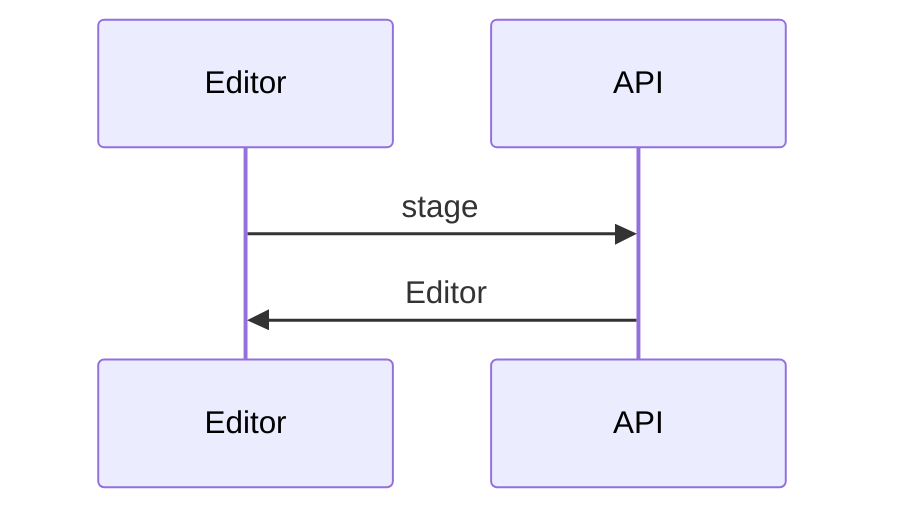

<!-- uzi:description:start v1 -->
Diagram summary.

**Size:** 3 files

| Category | Added | Deleted |
|:---------|------:|--------:|
| Code | +3 | −1 |
| **Total** | **+3** | **−1** |

### What changed
- One change.

<!-- uzi:description:end -->
