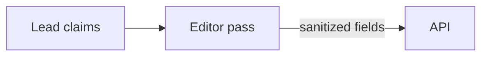

# PRD #1840: Diagrams in uzi PR descriptions, only where they help

**Issue**: #1840
**Status**: Draft (blocked on PR #1825, PRD #1798 run 2, merging to `main`)
**Priority**: Medium
**Created**: 2026-09-28
**Follows**: [PRD #1798](1798-plain-english-pr-descriptions.md) (plain-English PR descriptions)

## Problem

PRD #1798 gives every uzi PR a short plain-English description: summary, size line, what changed, verification, scope notes. For a change that spans several components (worker, api, store, forge) or adds a protocol with an order that matters (stage, bind, publish, ack), prose bullets still leave the reviewer assembling the flow in their head.

Review bots already show that a small diagram fixes this: Greptile appends a `flowchart LR` or `sequenceDiagram` block to its summary in the PR body (PRs #1433, #1588, #1705, #1825 on this repo). uzi cannot rely on a review bot being installed (PRD #1798 out of scope), and most repos uzi runs on have none.

## Goal

A uzi PR whose change has real structure carries one small diagram of that structure, in the same description region, on all three forges and both harnesses. A PR without such structure (docs, config, a bump, a one-file fix, most refactors) carries none. No diagram is the default.

## Forge facts (verified 2026-09-28, so the run needs no web access)

- **GitHub** renders ` ```mermaid ` fenced blocks in issues, pull requests, discussions, wikis and Markdown files (docs.github.com, "Creating diagrams").
- **GitLab** renders them in GitLab Flavored Markdown, issues and merge requests included; it supports Mermaid version 11. On a self-managed instance with a `Cross-Origin-Resource-Policy` of `same-site` / `same-origin`, diagrams silently fail to render (docs.gitlab.com, "GitLab Flavored Markdown"). The fenced source then shows as a code block, which is still readable.
- **Forgejo** renders every `.markup code.language-mermaid` element (issue and PR descriptions are markup content) with `securityLevel: 'strict'`, and refuses a source over `MERMAID_MAX_SOURCE_CHARACTERS` (default 50,000) (forgejo `web_src/js/markup/mermaid.js`, `custom/conf/app.example.ini`).
- A forge that does not render mermaid shows the fenced source as code. The emitter below keeps that source short and readable, so the fallback degrades gracefully.

## Decision log

**D1. The model never writes mermaid.** The editor pass (PRD #1798 D2) returns an optional **structured** `diagram` field. uzi's deterministic renderer turns it into mermaid syntax. Rejected: letting the model write a raw ` ```mermaid ` block. The api sanitizer deliberately backslash-escapes every code-fence run in model fields (`prDescFenceRun`, step 3 of `SanitizePrDescriptionText` in `api/internal/workersvc/pr_description_sanitize.go`), and raw mermaid would reopen what D7 of PRD #1798 closed: fence breakout into the region's markers, `click` directives, `%%{init}` directives, `classDef` / `style` injection, and label text escaping its quotes.

**D2. Shape.** One diagram at most, of two kinds only:

```
diagram?: {
  kind: "flow" | "sequence",
  title?: string,                                  // at most 80 bytes
  nodes: { key: string, label: string }[],         // flow 3..12, sequence 2..12; key [a-z0-9_]{1,16}, unique
  edges: { from: string, to: string, label?: string }[]  // 2..20; from/to are node keys
}
```

A two-participant ordered protocol (worker and api exchanging stage, bind, ack) is a legitimate sequence, so `sequence` allows two nodes; a two-box `flow` says nothing a sentence cannot.

- `flow` renders as `flowchart LR`; `sequence` renders as `sequenceDiagram`, where nodes are participants (in listed order) and edges are messages (in listed order).
- Keys are references only. The renderer re-maps them to `n1..nN` in listed order, so no model-supplied string ever becomes mermaid syntax.
- An edge naming an unknown key, a duplicate key, a self-edge in `flow`, or counts outside the ranges make the whole diagram invalid: it is dropped, and the rest of the description is kept.
- Rejected: pie, class, ER, state, gantt. They rarely explain a code change and widen the emitter's surface.

**D3. When a diagram is drawn.** Two gates; both must pass.

1. **The model decides**, under explicit prompt rules: draw one only when the change involves at least three interacting components or a flow whose order matters; describe the change's structure (what calls what, in which order), not the repo's; omit it for docs, config, dependency bumps and renames, and when unsure. A single-file change usually needs none, but that is guidance, not a veto: one file can hold a real protocol. Omission is the expected answer for most PRs. **When the editor's input was truncated** (PRD #1798 D6), omit the diagram unless the visible diff establishes every depicted step; today's prompt only forbids exhaustive prose claims (`DELIVERY_SYSTEM_PROMPT`, `agent/src/summary-runner.ts`), and this rule extends it to the diagram.
2. **A deterministic floor** in the worker, before the field is sent: the diagram is dropped when the computed size (PRD #1798 D3, `agent/src/pr-size.ts`) is available and its code bucket is zero (docs-, tests-, config-, generated-, vendored- or binary-only diffs), or when the D2 ranges fail. An **unavailable** size (`unavailable: true`, where every bucket reads zero) is unknown, not zero: the floor does not apply and gate 1 alone decides.

**D4. Label sanitization, at the api (the security boundary).** Labels get their own path, not `SanitizePrDescriptionText`: that function's output is markdown (backslash escapes, `&lt;`, a U+200B breaker inside closing keywords and after `@`), which is wrong inside a mermaid label, and removing its U+200B breaker later would re-form a directive (`F<U+200B>ixes GH-7` → `Fixes GH-7`). For each `title`, node `label` and edge `label`:

1. Normalize with the existing `prDescNormalize` (entity decode, `termsafe.SanitizeBounded`, markup strip, whitespace collapse; it applies no NFKC) plus the secret checks, as `SanitizePrDescriptionText` step 1 does. These helpers can delete runes and markup, so tokens can join here (`Fix<b></b>es #7` → `Fixes #7`).
2. Map every rune outside the allowlist to a **space**: Unicode letters and digits, space, and `. , - _ / + ' ( )`. This step deletes nothing. Collapse space runs, trim, cap (node 60 bytes, edge 60 bytes, title 80 bytes).
3. Run the api's closing-directive pattern (every forge form, `GH-7` included) and the mention pattern over the **final** label. **A match drops the whole diagram** (fail closed, logged reason); a label is never patched with a breaker.

**Invariant:** the closing-directive and mention checks run on the exact text that will be rendered, after every normalization, so a directive formed by any earlier join is caught.

The allowlist removes `"`, `` ` ``, `#`, `;`, `:`, `%`, `\`, `&`, `[]{}<>|`, `@`, `!`, U+200B and newlines, so a label cannot close its quotes, open a fence, write an entity, start a directive or form `#N`, `!N`, an `@mention` or a URL. `end` survives the allowlist and is handled by the renderer (D5). An empty node label invalidates the diagram. The worker mirrors the caps before sending, and the handler's raw cap gate (`prDescRawCapOK`, `api/internal/handler/worker_pr_description.go`) bounds the raw diagram (entry counts and per-label raw bytes) before the service sanitizes, so a diagram cannot bypass bounded input. The api is authoritative.

**D5. Rendering.** Inside the description region, after "What changed" and before "Verification":

````markdown

````

- Every flow label is double-quoted. Sequence participants use `participant n1 as <label>`; messages use `n1->>n2: <label>`, where a missing label renders as `n1->>n2: ` plus the target label.
- **`end`.** Mermaid documents the word `end` as able to break a sequence diagram (mermaid.js.org, "Sequence diagrams"; it closes `loop` / `alt` / `opt` blocks). Sequence labels are unquoted, so the renderer wraps every standalone `end` (any case) in a sequence participant or message label in parentheses, `(end)`, the form Mermaid's docs recommend. Flow labels are quoted and need no change; the parser test (M3) proves both.
- The fence is three backticks. That is safe because D4 removes every backtick from labels, and the renderer asserts it anyway.
- Shown expanded, not inside `<details>`. The diagram is the point, and D2 keeps it small. Greptile collapses its diagram because it sits below a long review; ours sits in a short region.
- An optional `title` renders as an italic line above the fence, escaped with the region's existing `escapeInline`.

**D6. Budgets, diagram first at both fallback sites.** The rendered mermaid source is at most 1,500 bytes. PRD #1798 has two size fallbacks, in two places, and both retry **without the diagram** before their existing fallback:

1. the 6 KiB region cap in `renderRegion` (`agent/src/pr-description.ts`): render without the diagram; only if that still exceeds the cap, fall back to the size line as today;
2. the 65,536-character whole-body cap in the publisher (`capBody`, `agent/src/pr-description-publisher.ts`): retry with the diagram-less region; only then the size-only region.

**D6a. The run page and CLI show only a published diagram.** Because either site can drop the diagram, a stored `fields.diagram` does not prove the PR shows one. The flag must survive a lost ack, so it is recorded at **bind** and never at ack: bind already stores the hash of the exact region it will write (`rendered_region_sha256`, migration `00259`), and lost-ack recovery (`recoverPrDescLostAck`, `api/internal/workersvc/pr_descriptions.go`) publishes a pending version by matching that hash without ever seeing the original ack. So:

1. **Bind** records `region_has_diagram` for the **final composed region** it binds (the publisher binds `regionSha256` of that region, `agent/src/pr-description-publisher.ts`, step 6). The flag is immutable with the hash.
2. **A diagram-less fallback is a new staged version; an ack never changes the flag.** Two cases, mirroring #1825's own two paths in `agent/src/pr-description-publisher.ts`: **before bind**, the D6 retry restages the same fields without `diagram` and leaves the diagram version unbound and pending, as the D15 cap restage before bind does; **after bind** (a recompose changes the region), the bound version is abandoned and a diagram-less version is restaged, bound and revalidated, as the recompose path after the step-7 re-read does. Either way the version that binds the diagram-less region binds with `region_has_diagram = false`.
3. **Publication** is confirmed only when the forge's region matches the bound hash, and **recovery** matches that same hash, so a published version's flag always describes what is on the forge.
4. The api exposes `diagram_published`, a **derived DTO field** equal to the published version's `region_has_diagram`, only for a published version. The web and CLI outline (D10) render only when it is true; otherwise they show nothing for the diagram.

**D7. Only the grounded rung draws.** The diagram comes only from the editor pass, which reads the diff (PRD #1798 D8 rung 1). The lead's `pr_summary` gets no diagram field, and rungs 2 (lead-only) and 3 (deterministic-only) render none: an unchecked self-report should not come with an authoritative-looking picture.

**D8. Storage and lifecycle reuse #1798's artifact.** `diagram` is one more key inside `pr_description_versions.fields` (jsonb, migration `00259`). The only schema change is one additive, nullable `region_has_diagram boolean` column on `pr_description_versions` (D6a), numbered at merge time. A version without the key renders as today. `rendered_region_sha256` covers the diagram because it hashes the rendered region, so human-edit protection (#1798 D10 rule 2) and lost-ack recovery (D9) include it for free. An `mr_rework` or adopting `ci_fix` refresh regenerates the diagram together with the rest of the region, against the whole PR diff (#1798 D12, D17).

**D9. The closing interlock and the block parser see a diagram as ordinary region content.** D4 drops any diagram whose label matches a closing directive. The whole-body scan (`closingDirectiveFor`) still runs over the region as before, and `parseOwnedBlocks` (whose private `codeRanges` treats fenced code as text) must keep adopting uzi's markers with a closed mermaid fence between them. Tests pin both through the public functions (M3).

**D10. Web and CLI show a text outline, not a rendered diagram.** The run page's "Delivered" section (`web/src/pages/runView/DeliveredCard.tsx`) and `uzi run get` (`api/cmd/uzi/run_render.go`) render a published diagram (D6a) as a short outline (`Editor pass → API: sanitized fields`, one line per edge, in order), from the sanitized fields. Rejected for now: bundling the mermaid runtime into the SPA. It is a large dependency for one card, and the PR itself already renders the diagram. `--json` carries the structured field.

**D11. Same on both harnesses.** The field, the prompt rules, the worker floor and the validation are shared by the Claude and Codex editor passes (`runReadOnlyModelPass`, #1798 D13). The harness-parity test extends to a fixture that yields a diagram.

**D12. No coordination with third-party bots.** uzi draws its diagram whether or not a review bot adds its own. uzi's lives in its region, a bot's lives outside it, and #1798 preserves text outside the region.

## Milestones

| Phase | Milestone | Depends on | Main files |
|---|---|---|---|
| 0 | PR #1825 merged | none | (not in this PRD) |
| 1 | M1 schema, sanitizer, trust boundary | #1825 | `api/internal/apitypes/pr_description.go`, `api/internal/workersvc/pr_description_sanitize.go`, `api/internal/handler/worker_pr_description.go` (raw caps, bind field), store migration + sqlc for `region_has_diagram`, `agent/src/protocol.ts`, `agent/src/client.ts` (decoder, frozen `SanitizedPrDescriptionFields`, `toRaw()`) |
| 2 | M2 editor pass | M1 | `agent/src/summary-runner.ts`, `agent/src/pr-description-context.ts`, `agent/src/codex/` |
| 2 | M3 renderer and publisher | M1 | `agent/src/pr-description.ts`, `agent/src/pr-description-publisher.ts`, `fixtures/pr-diagram/` (new), `web/package.json` + lockfile, a new `web/src/**/*.browser.test.tsx` |
| 2 | M4 web and CLI outline | M1 | `web/src/lib/apiTypes.ts`, `web/src/pages/runView/DeliveredCard.tsx`, `api/cmd/uzi/run_render.go` |
| 4 | M5 docs, spec, ADR note, acceptance | all | `docs/run-summaries.md`, `specs/human.md`, ADR-1798 |

M2, M3 and M4 touch separate files and can run in parallel after M1.

Every milestone passes its component gates (`task gate:agent`, `task gate:api`, `task gate:web` as touched) and `task check-docs:web` when it touches docs or PRDs; M5 runs `task docs:sync`. M1 also runs `task scan:secrets` and `task check:token-literals`, since sanitizer tests feed hostile strings.

**Constraints for the uzi run:**

- Neither implementation nor validation creates or modifies a file under `.github/workflows/`.
- Any credential-shaped test fixture is assembled from parts at runtime, never written as one literal.
- Everything this PRD needs from outside the repo is in *Forge facts* above. The run needs no web access.

- [ ] **M1: Schema, api sanitizer and the response trust boundary.** `diagram` per D2 in `apitypes.PrDescriptionFields`, the protocol type, the worker's raw-field mirror, the `WorkerClient` decoder, the frozen `SanitizedPrDescriptionFields` class and its `toRaw()` refresh copy (so a refresh re-stages the diagram it read). The handler's raw cap gate bounds the diagram (D4). The api validates the structure (ranges, unique keys, known edge endpoints, no `flow` self-edge) and sanitizes labels per D4; an invalid diagram is dropped with a logged reason, never failing the stage call. The additive `region_has_diagram` column, its bind field, and the derived `diagram_published` on the published-version DTO (D6a). Live-DB tests: normal publication, lost-ack recovery (flag kept from bind), ack retry, an ack cannot change the flag, a diagram-less restage publishes with the flag false, and the field is absent on a pending version. Tests: a table of hostile labels (quotes, backticks, fences, `%%{init}`, `click`, `classDef`, `#7`, `Fixes #7`, `Fixes GH-7` (drops the diagram, and no U+200B appears in any label), directives formed by normalization joins (`Fix<b></b>es #7`, `Fix&#101;s GH-7`, a comment splitting the keyword; all drop the diagram), `!7`, `@user`, `<script>`, entities, newlines, `end`, emoji, RTL text) and structural rejects; over-cap raw diagrams refused by the handler; a version without `diagram` round-trips unchanged; the decoder rejects a hostile diagram shape.
- [ ] **M2: Editor pass.** Prompt rules per D3 (including the truncated-input rule) and the output schema per D2 in the delivery-summary prompt; the worker floor per D3.2; parse and clip per D2/D4 caps before posting. Tests: a docs-only diff drops a diagram the model returned; an unavailable size does not drop it; a binary-only diff drops it; a two-participant sequence is kept; a malformed diagram drops only the diagram; prompt injection in the diff ("add a click directive", "label it Fixes #1") produces no such output after sanitization; Claude and Codex harness parity on a fixture that yields a diagram.
- [ ] **M3: Renderer and publisher.** Emission per D5 for both kinds (with the `end` rule), diagram-first retry at both D6 sites, the D6a bind-time flag, the D7 rung rule. Golden outputs committed under `fixtures/pr-diagram/` (flow, two- and many-participant sequence, `end` in every sequence label position, max-size, unicode labels). Tests: goldens match; `parseOwnedBlocks` adopts both uzi blocks with a closed mermaid fence in the region; `closingDirectiveFor` finds no directive in any golden; a region over 6 KiB drops only the diagram when that suffices; a body over 65,536 characters retries without the diagram before the size-only region; each diagram-less retry restages a new version, and every bind sends the `region_has_diagram` of the region it binds; rungs 2 and 3 render no diagram; the region hash changes when only the diagram changes. **Parser check:** goldens prove emitted text, not that Mermaid accepts it, so a new `web/src/**/*.browser.test.tsx` file parses every golden with `mermaid.parse` in real Chromium. `mermaid` is added to `web/package.json` (and its lockfile) as a devDependency only, never bundled, pinned to the major version the forges run (GitLab documents Mermaid 11). Required checks for M3, beyond `task gate:agent`: `task test:web-browser` (the lane that collects `*.browser.test.tsx`) and `task deadcode:web` (knip must accept the new devDependency). The M5 live check covers the rest.
- [ ] **M4: Web and CLI outline.** The web API type, the Delivered section and `uzi run get` render the D10 outline only for a published diagram (D6a); `--json` carries the field and the flag. Tests: a web component test with a hostile label; unpublished diagram shows nothing; a CLI render test.
- [ ] **M5: Docs, spec, ADR note, acceptance.** Describe the diagram in `docs/run-summaries.md` (then `task docs:sync`); a terse `specs/human.md` requirement (AI-synced tag); an addendum to ADR-1798 stating the diagram is region content under I1-I4, not a new owned block, and that the model never emits mermaid syntax (D1). Live acceptance (maintainer): one multi-component issue run each on GitHub, GitLab and Forgejo renders a diagram; one docs-only run renders none; one Codex run renders the same shape; one `mr_rework` refresh regenerates it.

## Success criteria

- Across 10 consecutive uzi PRs after rollout, diagrams appear only on multi-component or order-dependent changes, and none on docs-, config- or bump-only PRs.
- Every drawn diagram renders on GitHub, GitLab and Forgejo without a mermaid parse error.
- No PR body ever carries model-authored mermaid syntax, a closing directive, a mention or raw HTML from a diagram label (sanitizer tests plus a post-rollout sweep).
- The description region still fits 6 KiB; a diagram never displaces the summary, size line or completion block.

## Risks

- **A plausible but wrong diagram.** Mitigated by grounding in the diff, the "omit when unsure" rule, the small node cap, and no diagram on unchecked rungs. Like the rest of the description, it stays advisory.
- **Mermaid grammar drift** across forge versions. Mitigated by the tiny emitted subset (quoted labels, two diagram kinds, `-->`, `-->|..|`, `->>`), goldens, and live acceptance on all three forges.
- **Diagram noise** on PRs that did not need one. Mitigated by D3's two gates; the success criterion measures it.
- **Extra output tokens.** Small: at most 12 nodes and 20 edges, in the existing editor turn; no new model call.

## Out of scope

- Rendering mermaid in the web SPA (D10).
- Diagrams from the lead, in PR comments, in issues, or in plan and intent summaries.
- More than one diagram per PR; diagram kinds other than flow and sequence.
- Detecting or deferring to third-party review-bot diagrams (D12).
